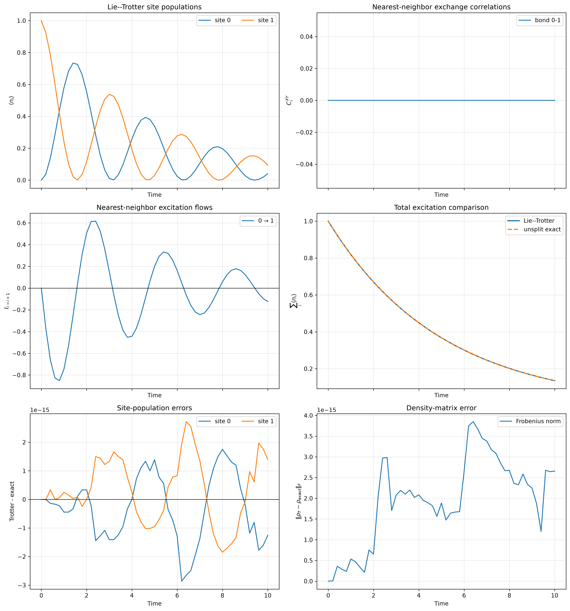
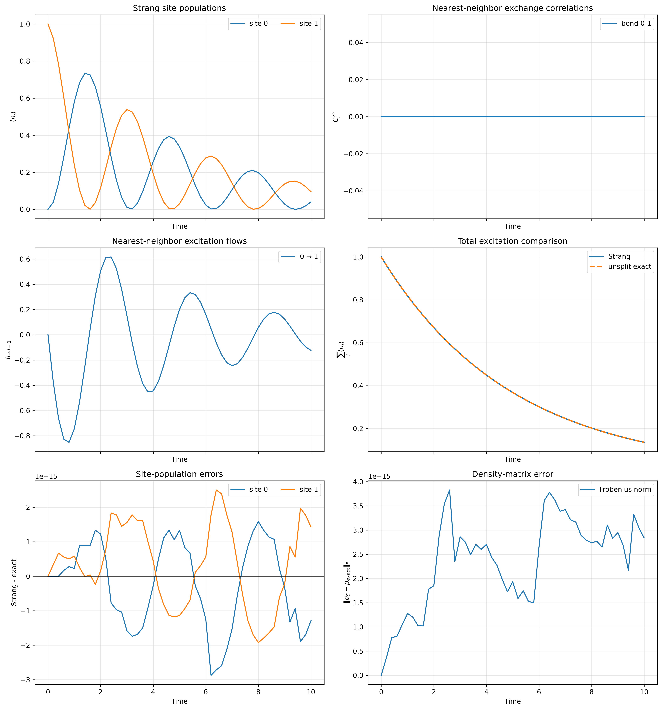
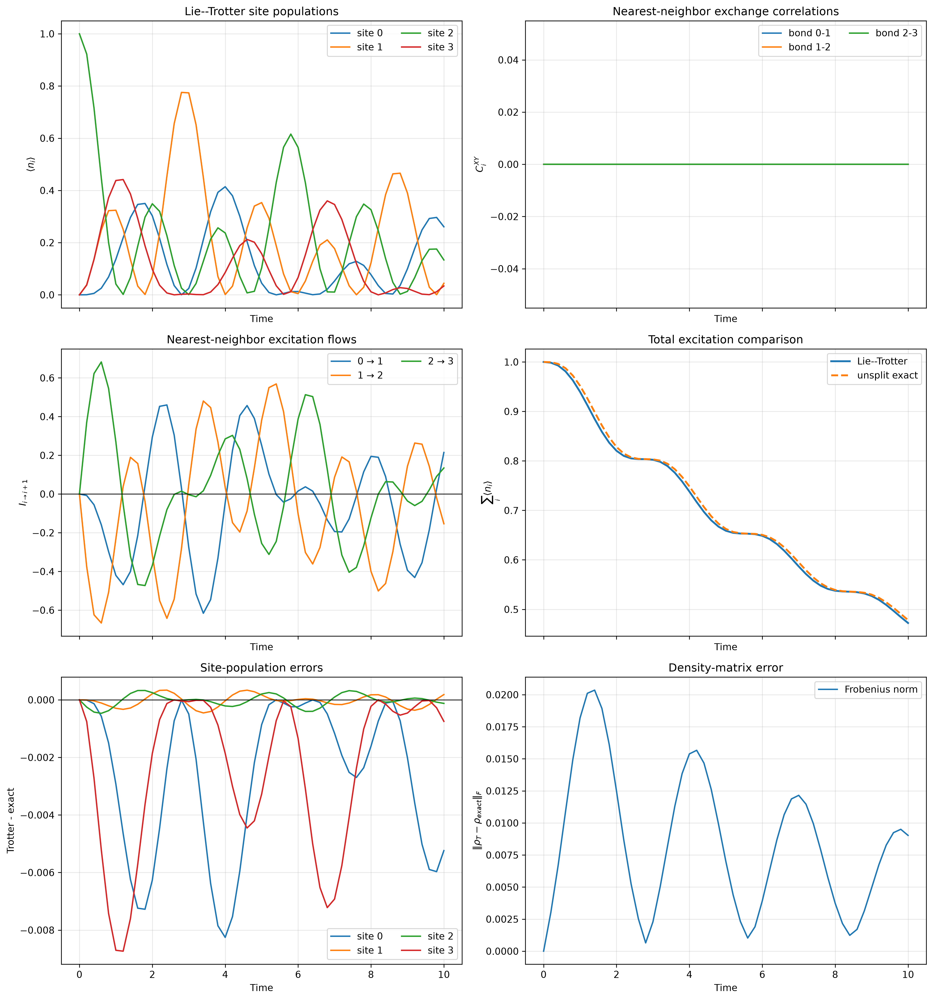
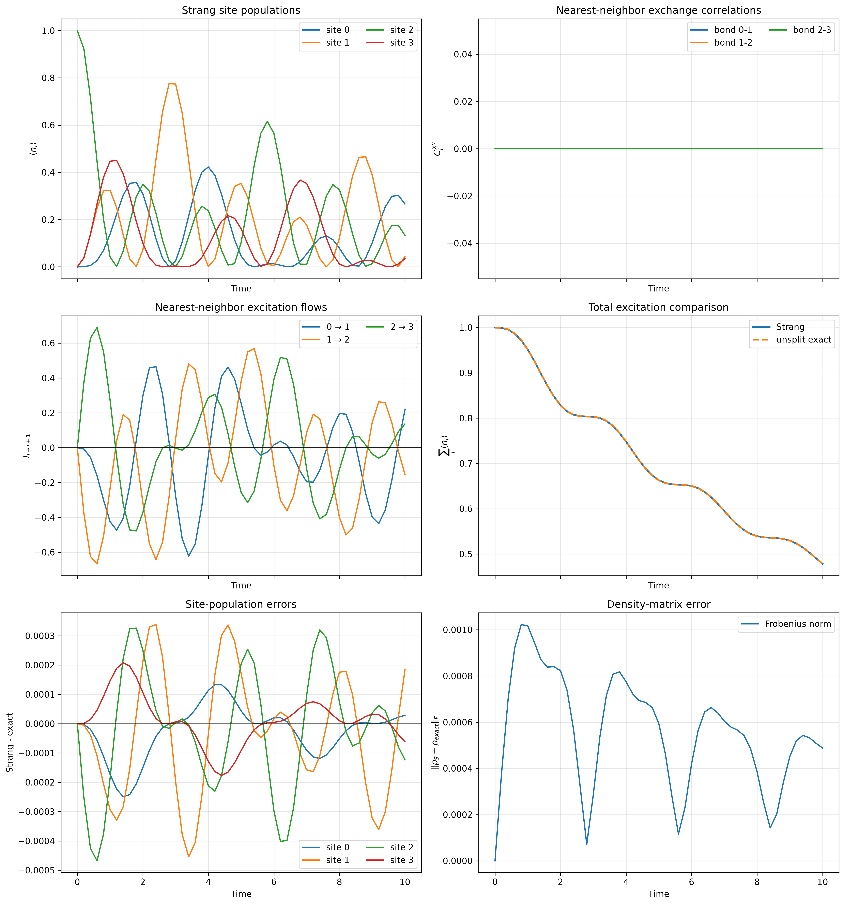
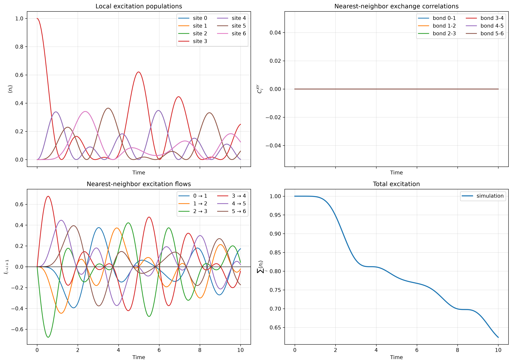
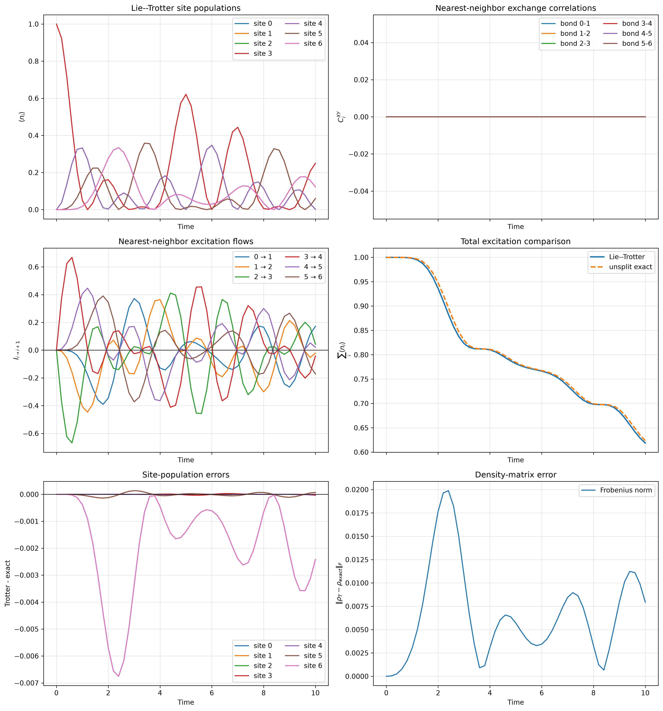
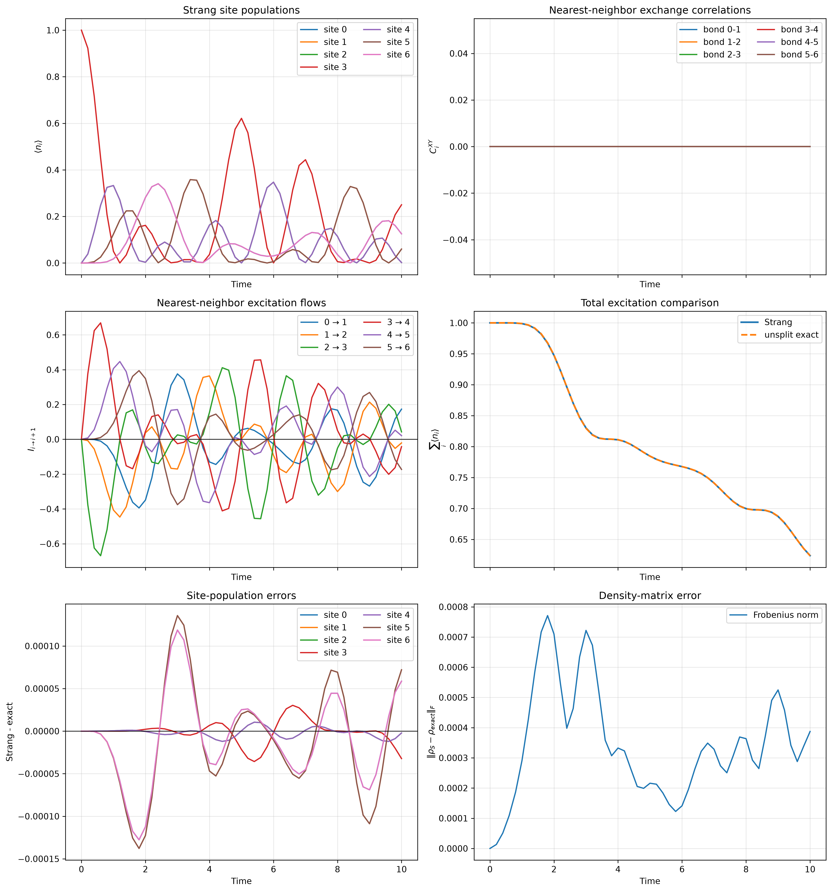

# Experiment 1: Boundary-damped XY chain

## Objective

This experiment studies coherent excitation transport in an open XY spin
chain whose only dissipative channels are at the two ends. The dynamics are
computed in three ways:

1. unsplit (exact-reference) Liouvillian evolution;
2. first-order Lie--Trotter splitting; and
3. second-order Strang splitting, with the system evolution in the middle.

The exact-reference solution is used to quantify the errors of the two
product-formula solvers.

## Physical model

For a chain of $N$ qubits with open boundary conditions, the Hamiltonian is

$$
H = \frac{J}{2}\sum_{i=0}^{N-2}
    \left(X_iX_{i+1}+Y_iY_{i+1}\right)
    + \frac{h}{2}\sum_{i=0}^{N-1}Z_i.
$$

The $XX+YY$ term moves excitations between neighboring sites, while the
field term changes their phases. Both terms conserve the total excitation
number.

Dissipation is present only at the first and last sites:

$$
V_L=\sqrt{\gamma}\,\sigma^-_0,
\qquad
V_R=\sqrt{\gamma}\,\sigma^-_{N-1}.
$$

There are no jump operators on the interior sites. Excitations therefore
propagate coherently through the bulk and can leave the chain only after
reaching one of its boundaries.

The density matrix obeys the Lindblad master equation

$$
\frac{d\rho}{dt}
=-i[H,\rho]
+\sum_{a\in\{L,R\}}
\left(
V_a\rho V_a^\dagger
-\frac{1}{2}\{V_a^\dagger V_a,\rho\}
\right).
$$

## Sparse Liouville-space representation

The implementation in [library/classical.py](../library/classical.py) builds
all operators as SciPy sparse matrices. The density matrix is vectorized in
column-major order:

$$
|\rho\rangle\!\rangle=\operatorname{vec}(\rho).
$$

Using

$$
\operatorname{vec}(A\rho B)
=(B^T\otimes A)\operatorname{vec}(\rho),
$$

the master equation becomes

$$
\frac{d}{dt}|\rho\rangle\!\rangle
=\mathcal L|\rho\rangle\!\rangle.
$$

The Hamiltonian generator is

$$
\mathcal L_H
=-i\left(I\otimes H-H^T\otimes I\right),
$$

and the generator for an individual jump operator $V_a$ is

$$
\mathcal D_a
=V_a^*\otimes V_a
-\frac{1}{2}I\otimes(V_a^\dagger V_a)
-\frac{1}{2}(V_a^\dagger V_a)^T\otimes I.
$$

Thus,

$$
\mathcal L=\mathcal L_H+\mathcal D_L+\mathcal D_R.
$$

## Initial state and observables

The scripts initialize a computational-basis state with one excitation near
the center of the chain:

$$
|\psi_0\rangle=|0\cdots010\cdots0\rangle,
\qquad
\rho_0=|\psi_0\rangle\langle\psi_0|.
$$

The following quantities are evaluated:

- Local excitation population:

  $$
  n_i=\frac{I-Z_i}{2}.
  $$

- Nearest-neighbor exchange correlation:

  $$
  C_i^{XY}=X_iX_{i+1}+Y_iY_{i+1}.
  $$

- Excitation flow from site $i$ to site $i+1$:

  $$
  I_{i\rightarrow i+1}
  =-\frac{J}{2}
  \left(X_iY_{i+1}-Y_iX_{i+1}\right).
  $$

- Total excitation:

  $$
  N_{\mathrm{exc}}=\sum_i\langle n_i\rangle.
  $$

Because only the boundary sites are damped,

$$
\frac{dN_{\mathrm{exc}}}{dt}
=-\gamma\left(\langle n_0\rangle
+\langle n_{N-1}\rangle\right).
$$

The interior continuity equation has no dissipative loss term. The term
$-\gamma\langle n_i\rangle$ appears only at $i=0$ and $i=N-1$.

## Evolution methods

### Unsplit exact-reference evolution

The reference calculation evaluates

$$
|\rho(t)\rangle\!\rangle
=e^{t\mathcal L}|\rho_0\rangle\!\rangle.
$$

The implementation uses scipy.sparse.linalg.expm_multiply, which applies the
action of the matrix exponential without constructing a dense exponential.
Here, “exact” means unsplit evolution up to the numerical tolerance of this
sparse exponential calculation. It has no Trotter splitting error.

The driver is [exact.py](exact.py).

### First-order Lie--Trotter evolution

Define

$$
E_H(\tau)=e^{\tau\mathcal L_H},\qquad
E_L(\tau)=e^{\tau\mathcal D_L},\qquad
E_R(\tau)=e^{\tau\mathcal D_R}.
$$

One Lie--Trotter substep applies:

~~~text
system full-step -> left jump full-step -> right jump full-step
~~~

Equivalently,

$$
|\rho_{n+1}\rangle\!\rangle
\approx
E_R(\Delta t)E_L(\Delta t)E_H(\Delta t)
|\rho_n\rangle\!\rangle.
$$

Its local splitting error is $O(\Delta t^2)$, producing a global error of
$O(\Delta t)$ over a fixed total evolution time. The driver is
[lie_trotter.py](lie_trotter.py).

### Second-order Strang evolution

The Strang solver places the full system evolution in the middle. One
substep applies:

~~~text
left jump half-step
-> right jump half-step
-> system full-step
-> right jump half-step
-> left jump half-step
~~~

Thus,

$$
|\rho_{n+1}\rangle\!\rangle
\approx
E_L\!\left(\frac{\Delta t}{2}\right)
E_R\!\left(\frac{\Delta t}{2}\right)
E_H(\Delta t)
E_R\!\left(\frac{\Delta t}{2}\right)
E_L\!\left(\frac{\Delta t}{2}\right)
|\rho_n\rangle\!\rangle.
$$

The composition is palindromic. Its local splitting error is
$O(\Delta t^3)$, giving a global error of $O(\Delta t^2)$. The driver is
[strang_trotter.py](strang_trotter.py).

The two boundary dissipators act on different sites and commute with each
other in this model. The important splitting error therefore comes from the
noncommutativity of the Hamiltonian generator with the boundary dissipators.

### Method summary

| Method | Generator treatment | Global splitting order | Exponential actions |
|---|---|---:|---:|
| Exact reference | Full $\mathcal L$, unsplit | No splitting error | Full sparse generator |
| Lie--Trotter | Sequential full steps | 1 | 3 per substep |
| Strang | Symmetric jump half-steps around the system | 2 | 5 per substep |

## Numerical checks

All methods are checked using:

- trace preservation, $\operatorname{Tr}\rho(t)=1$;
- Hermiticity, $\rho(t)=\rho(t)^\dagger$;
- positivity through the smallest eigenvalue of $\rho(t)$;
- the boundary-loss equation for total excitation; and
- the local continuity equations.

Each exponential factor in a product formula is generated by either a
Hamiltonian generator or a complete Lindblad dissipator. It is therefore a
physical quantum channel. Products of these factors preserve trace and
positivity, apart from floating-point roundoff.

## Controlled comparisons

The comparisons use identical parameters for all three methods:

| Parameter | Value |
|---|---:|
| Number of qubits $N$ | 2, 4, and 7 |
| Exchange coupling $J$ | 1.0 |
| Field $h$ | 0.0 |
| Boundary decay rate $\gamma$ | 0.2 |
| Initial excited site | $\lfloor N/2\rfloor$ |
| Final time | 10.0 |
| Saved time points | 51 |
| Output interval | 0.2 |

The Trotter step is controlled independently of the saved output grid:

$$
\Delta t
=\frac{0.2}{\mathrm{TROTTER\_STEPS\_PER\_INTERVAL}}.
$$

The density-matrix error is measured with the Frobenius norm,

$$
\epsilon_F(t)=
\left\|\rho_{\mathrm{split}}(t)-\rho_{\mathrm{exact}}(t)\right\|_F,
$$

and the table reports its maximum over all saved times. The exact-reference
method has zero splitting error by definition.

| $N$ | $\Delta t$ | Lie max. $\epsilon_F$ | Strang max. $\epsilon_F$ | Lie reduction | Strang reduction |
|---:|---:|---:|---:|---:|---:|
| 2 | 0.200 | $3.85\times10^{-15}$ | $3.83\times10^{-15}$ | -- | -- |
| 2 | 0.100 | $3.94\times10^{-15}$ | $7.77\times10^{-15}$ | roundoff | roundoff |
| 2 | 0.050 | $7.36\times10^{-15}$ | $3.19\times10^{-14}$ | roundoff | roundoff |
| 4 | 0.200 | $2.0358\times10^{-2}$ | $1.0226\times10^{-3}$ | -- | -- |
| 4 | 0.100 | $1.0191\times10^{-2}$ | $2.5512\times10^{-4}$ | $2.00\times$ | $4.01\times$ |
| 4 | 0.050 | $5.0992\times10^{-3}$ | $6.3747\times10^{-5}$ | $2.00\times$ | $4.00\times$ |
| 7 | 0.200 | $1.9883\times10^{-2}$ | $7.7098\times10^{-4}$ | -- | -- |
| 7 | 0.100 | $9.9727\times10^{-3}$ | $1.9231\times10^{-4}$ | $1.99\times$ | $4.01\times$ |
| 7 | 0.050 | $4.9944\times10^{-3}$ | $4.8051\times10^{-5}$ | $2.00\times$ | $4.00\times$ |

### Results for $N=2$

For two qubits, both sites are damped boundaries. The sum of the two equal
amplitude-damping generators commutes with the excitation-preserving system
generator. The jump generators also commute with each other. Consequently,
both product formulas reproduce the unsplit evolution exactly; the errors
near $10^{-14}$ in the table are floating-point roundoff rather than Trotter
error.

*Figure 1. Exact-reference observables for the two-qubit chain.*

*Figure 2. Lie--Trotter results for $N=2$ and $\Delta t=0.2$. The numerical
error remains at floating-point precision.*

*Figure 3. Strang results for $N=2$ and $\Delta t=0.2$. As in the Lie result,
the apparent error is only numerical roundoff.*

### Results for $N=4$

With interior sites present, the boundary dissipators no longer commute with
the complete Hamiltonian evolution. A genuine splitting error appears.

*Figure 4. Exact-reference observables for the four-qubit chain.*

*Figure 5. Lie--Trotter results for $N=4$ and $\Delta t=0.2$.*

*Figure 6. Strang results for $N=4$ and $\Delta t=0.2$.*

### Results for $N=7$

The seven-qubit case tests the same formulas in a Hilbert space of dimension
$2^7=128$ and a Liouville space of dimension $4^7=16384$.

*Figure 7. Exact-reference observables for the seven-qubit chain.*

*Figure 8. Lie--Trotter results for $N=7$ and $\Delta t=0.2$.*

*Figure 9. Strang results for $N=7$ and $\Delta t=0.2$, with the system
propagator in the middle.*

## Interpretation

The results agree with product-formula theory:

- For $N=2$, both decompositions are exact because of the special commuting
  structure of the two-site problem with equal damping on both sites.
- For $N=4$ and $N=7$, halving $\Delta t$ reduces the Lie error by
  approximately two, confirming first-order global convergence.
- For $N=4$ and $N=7$, halving $\Delta t$ reduces the Strang error by
  approximately four, confirming second-order global convergence.
- At $N=4$ and $\Delta t=0.2$, Strang is about 20 times more accurate than
  Lie in the maximum Frobenius error.
- At $\Delta t=0.2$, Strang is about 26 times more accurate than Lie in the
  seven-qubit calculation.
- At $N=7$ and $\Delta t=0.05$, Strang is about 104 times more accurate than
  Lie.

The additional accuracy has a computational cost. With two jump generators,
Lie uses three exponential actions per substep, whereas the current Strang
implementation uses five. Nevertheless, Strang can often reach a target
accuracy with a much larger timestep, making it the more efficient method
when accuracy is important.

## Reproduction

From the repository root, run:

~~~bash
python -m Model1.exact
python -m Model1.lie_trotter
python -m Model1.strang_trotter
~~~

The scripts save figures under figures/ relative to this report (that is,
Model1/figures/ from the repository root). For a direct comparison, the
values of N_QUBITS, J, h, gamma, T_FINAL, NUM_TIMES, and
INITIALLY_EXCITED_SITES must be identical in all three drivers. The value of
TROTTER_STEPS_PER_INTERVAL may then be varied in the Lie and Strang scripts
to perform a convergence study without changing the saved output times.
