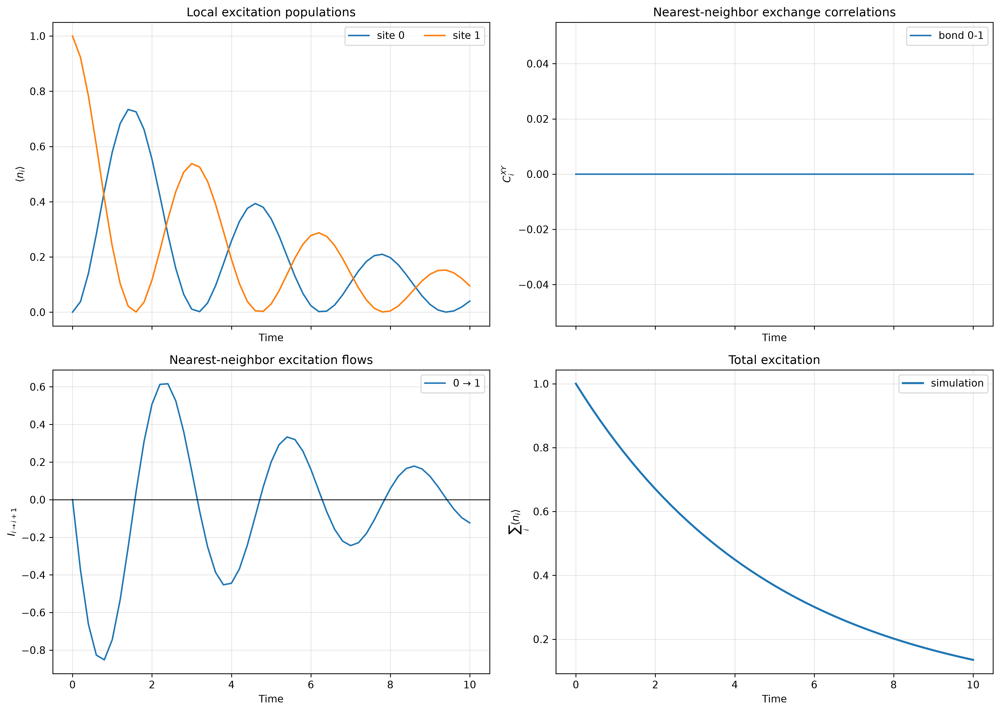
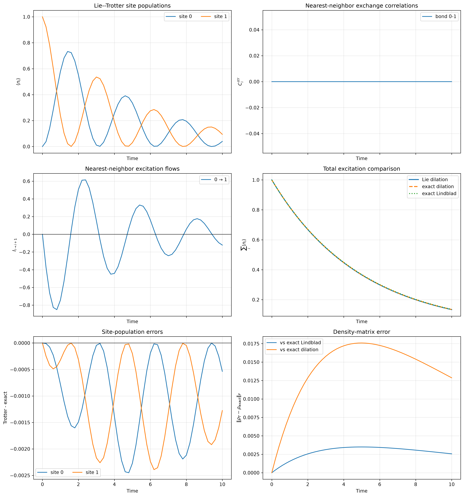
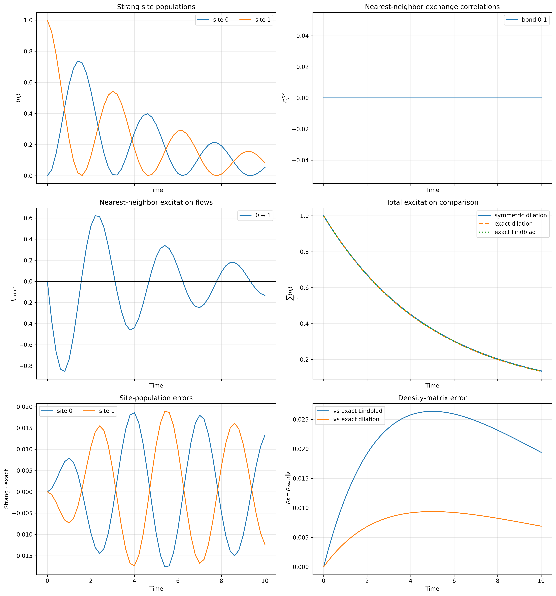
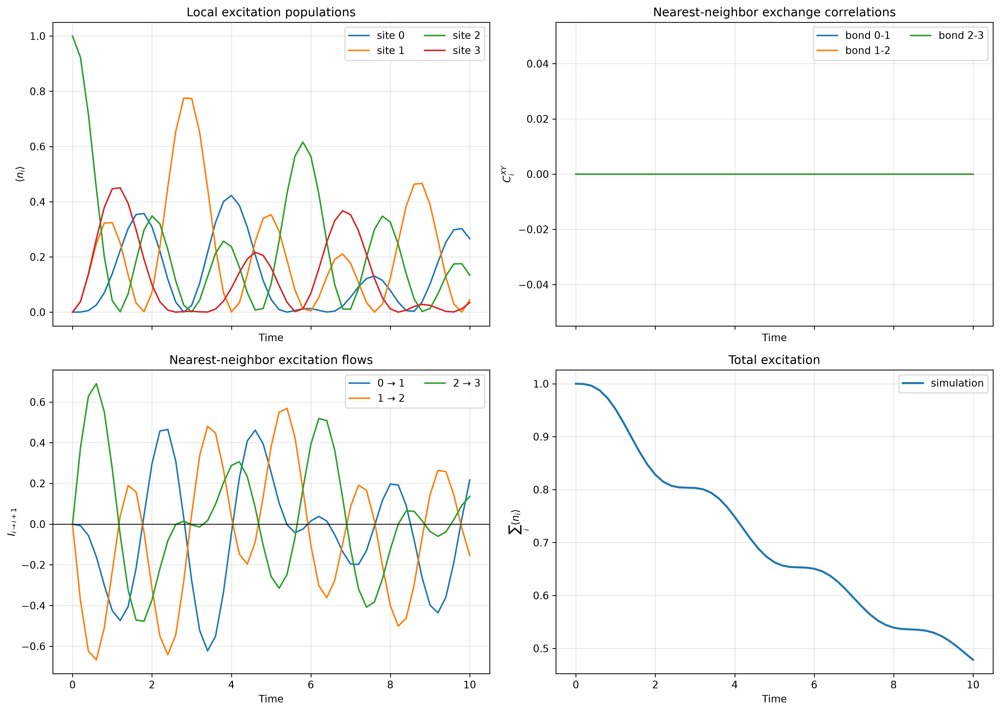
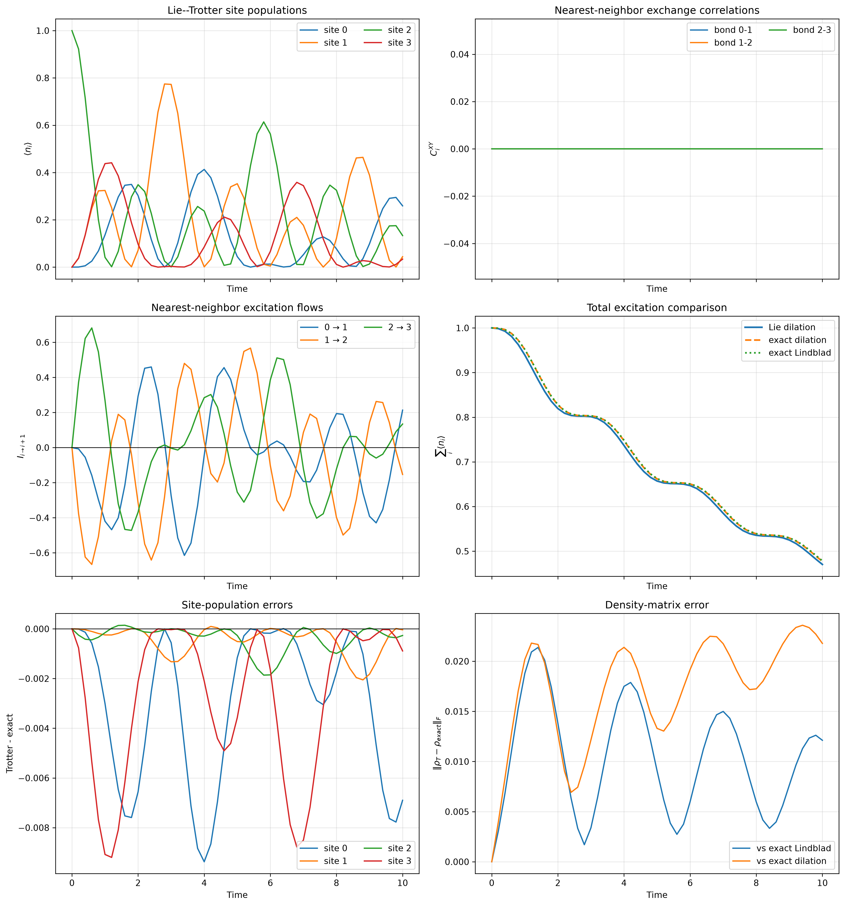
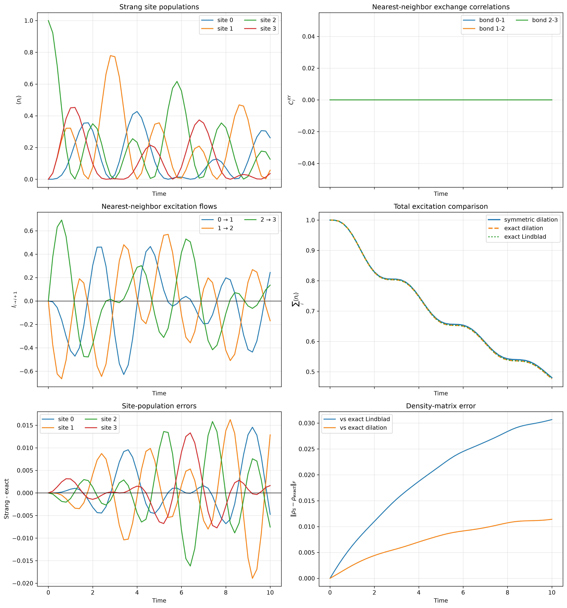
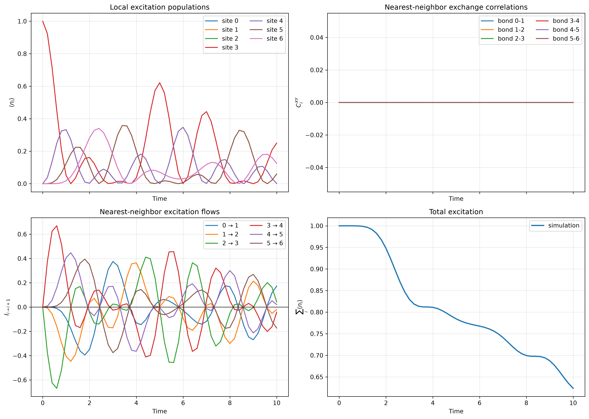
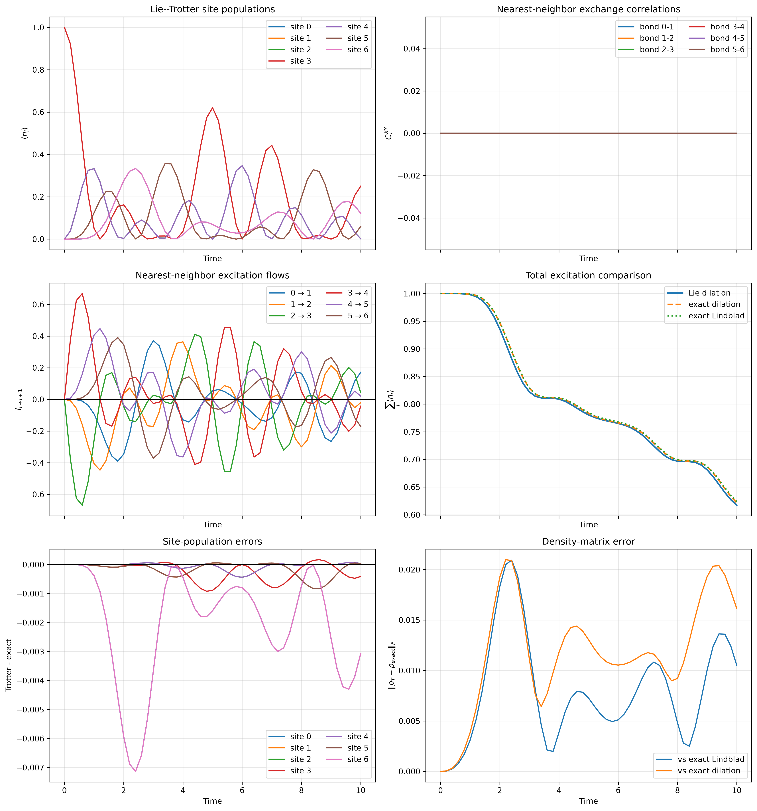
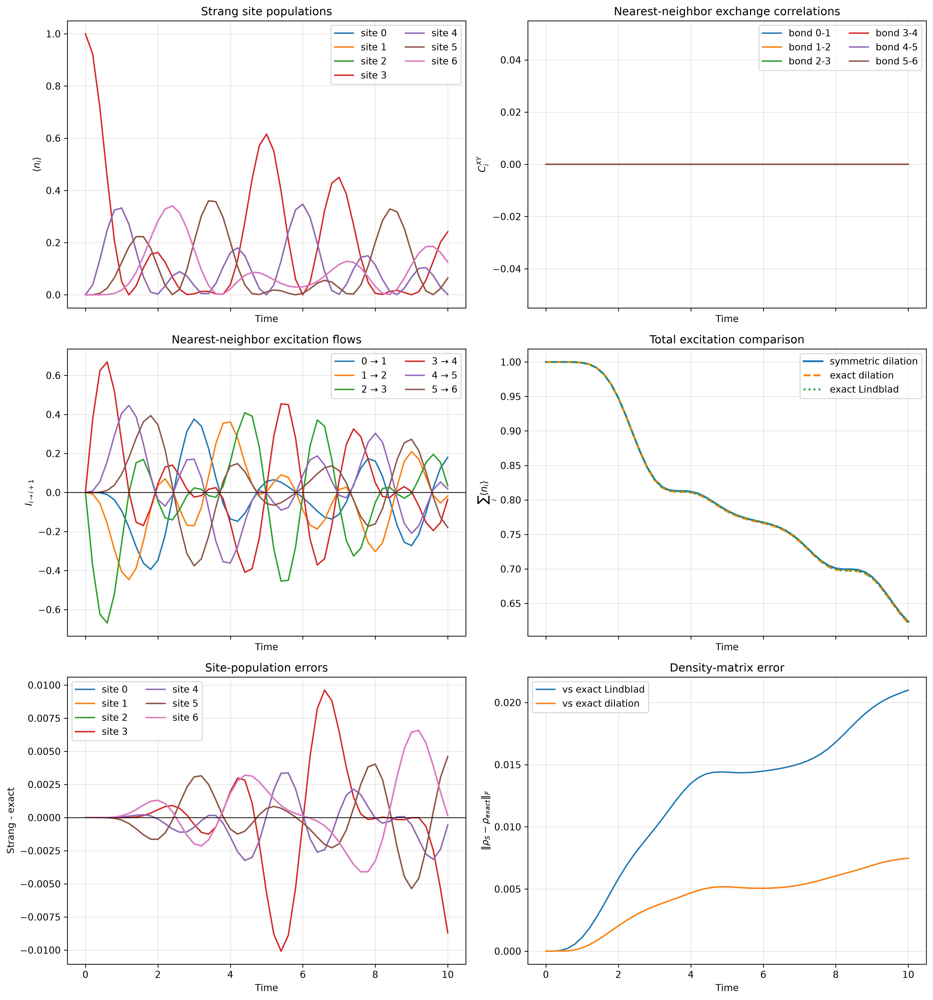

# Experiment 1: Model Problem I

This folder provides the classical reference for Model Problem I in
`writeup.pdf`. The physical system is an open chain of $N\geq2$ qubits with
Hamiltonian

$$
H=\frac{J}{2}\sum_{n=0}^{N-2}
  (X_nX_{n+1}+Y_nY_{n+1})
  +\frac{h}{2}\sum_{n=0}^{N-1}Z_n,
$$

and exactly two amplitude-damping jump operators, one at each boundary,

$$
V_1=\sqrt{\gamma}\,\sigma^-_{0},
\qquad
V_2=\sqrt{\gamma}\,\sigma^-_{N-1}.
$$

There are no jump operators on the interior qubits.

The exact physical reference solves

$$
\dot\rho=-i[H,\rho]
+\sum_{j=1}^2
\left(V_j\rho V_j^\dagger
-\frac12\{V_j^\dagger V_j,\rho\}\right)
$$

without a product-formula split. This is implemented by
[`exact.py`](exact.py) using the Liouvillian routines in
[`library/classical.py`](../../library/classical.py).

## Shared-ancilla Hamiltonian dilation

The Lie and symmetric scripts do not split the Liouvillian into independent
dissipative channels. They use the Hamiltonian dilation from the write-up.
For a physical step of length $\Delta t$, define

$$
K_H=\Delta t\,|0\rangle\!\langle0|_a\otimes H,
$$

$$
K_j=\sqrt{\Delta t}\left(
|j\rangle\!\langle0|_a\otimes V_j
+|0\rangle\!\langle j|_a\otimes V_j^\dagger
\right),\qquad j=1,2.
$$

There is one shared three-level ancilla with basis
$\{|0\rangle_a,|1\rangle_a,|2\rangle_a\}$. In a circuit this qutrit is
encoded in two ancilla qubits as

$$
|0\rangle_a=|00\rangle,\qquad
|1\rangle_a=|01\rangle,\qquad
|2\rangle_a=|10\rangle,
$$

while $|11\rangle$ is unused. Thus the circuit representation needs $N+2$
qubits in total; it has four qubits only when $N=2$. The classical code uses
the equivalent minimal three-dimensional ancilla representation.

For every substep, the ancilla is prepared in $|0\rangle_a$, the complete
dilation unitary is applied, and only then is the ancilla traced out:

$$
\Phi_{\Delta t}(\rho)=
\operatorname{Tr}_a\!\left[
U_{\Delta t}
(|0\rangle\!\langle0|_a\otimes\rho)
U_{\Delta t}^\dagger
\right].
$$

The ancilla is not reset between $K_H$, $K_1$, and $K_2$. Resetting or
tracing between these factors would produce independent jump channels and
would no longer be the shared-ancilla dilation in the write-up.

## Product formulas

Three dilation unitaries are available through
`classical.hamiltonian_dilation_evolve`:

1. Unsplit dilation:

   $$
   U_{\mathrm{dil}}
   =e^{-i(K_H+K_1+K_2)}.
   $$

2. Lie product formula, applied chronologically as
   $K_H\rightarrow K_1\rightarrow K_2$:

   $$
   U_{\mathrm{Lie}}
   =e^{-iK_2}e^{-iK_1}e^{-iK_H}.
   $$

3. Symmetric jump splitting with the system term in the middle, applied
   chronologically as
   $K_1/2\rightarrow K_2/2\rightarrow K_H\rightarrow
   K_2/2\rightarrow K_1/2$:

   $$
   U_{\mathrm{sym}}
   =e^{-iK_1/2}e^{-iK_2/2}e^{-iK_H}
    e^{-iK_2/2}e^{-iK_1/2}.
   $$

The unsplit dilation is an exact exponential of the finite-step dilation
Hamiltonian; it is not the exact Lindblad channel. All three dilation
channels approach the Lindblad dynamics as $\Delta t\to0$.

The drivers are [`lie_trotter.py`](lie_trotter.py) and
[`strang_trotter.py`](strang_trotter.py). Each compares its result against
both the unsplit dilation and the exact Lindblad solution, which separates
product-formula error from finite-step dilation error.

## Numerical results

The figures below use

| Parameter | Value |
|---|---:|
| $J$ | $1.0$ |
| $h$ | $0.0$ |
| $\gamma$ | $0.2$ |
| Final time $T$ | $10.0$ |
| Saved time points | $51$ |
| Dilation step $\Delta t$ | $0.2$ |
| Initial excitation | $n=\lfloor N/2\rfloor$ |

The density-matrix errors are Frobenius norms. The product-formula column
uses the unsplit finite-step dilation as its reference, whereas the other
density-matrix columns use the exact Lindblad evolution.

| $N$ | Method | Maximum error | Final error | Maximum population error | Maximum product-formula error |
|---:|---|---:|---:|---:|---:|
| 2 | Lie | $3.4941\times10^{-3}$ | $2.5622\times10^{-3}$ | $2.4501\times10^{-3}$ | $1.7586\times10^{-2}$ |
| 2 | Symmetric | $2.6370\times10^{-2}$ | $1.9411\times10^{-2}$ | $1.8915\times10^{-2}$ | $9.3797\times10^{-3}$ |
| 4 | Lie | $2.1377\times10^{-2}$ | $1.2116\times10^{-2}$ | $9.3726\times10^{-3}$ | $2.3592\times10^{-2}$ |
| 4 | Symmetric | $3.0680\times10^{-2}$ | $3.0680\times10^{-2}$ | $1.8909\times10^{-2}$ | $1.1412\times10^{-2}$ |
| 7 | Lie | $2.0934\times10^{-2}$ | $1.0508\times10^{-2}$ | $7.1346\times10^{-3}$ | $2.0979\times10^{-2}$ |
| 7 | Symmetric | $2.0995\times10^{-2}$ | $2.0995\times10^{-2}$ | $1.0085\times10^{-2}$ | $7.4749\times10^{-3}$ |

### Results for $N=2$







### Results for $N=4$







### Results for $N=7$







## Running the experiment

The default is $N=7$. Select any $N\geq2$ with `--n-qubits`. For example,
run the two-qubit case from the repository root with

```bash
uv run python Model1/Experiment1/exact.py --n-qubits 2
uv run python Model1/Experiment1/lie_trotter.py --n-qubits 2
uv run python Model1/Experiment1/strang_trotter.py --n-qubits 2
```
