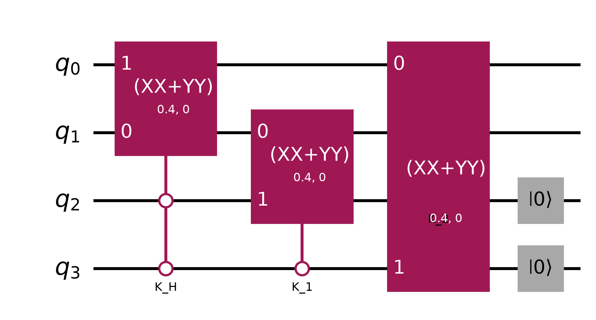
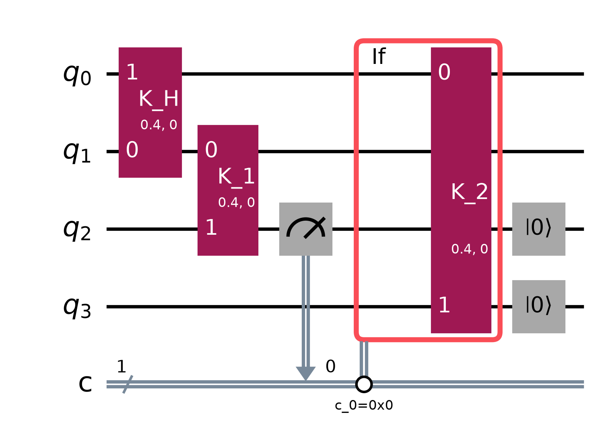
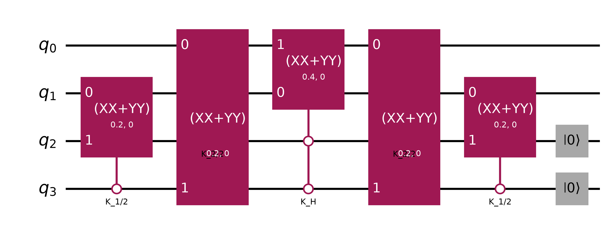
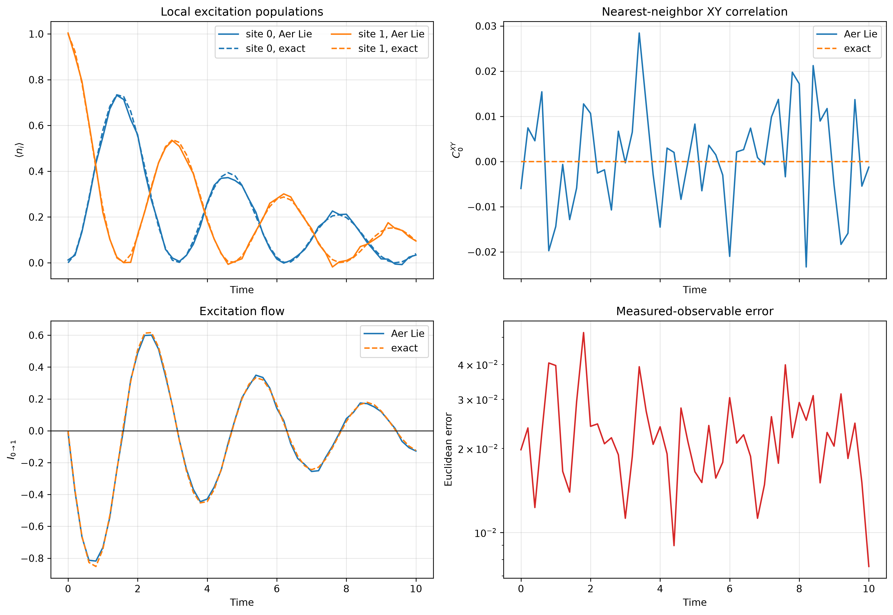
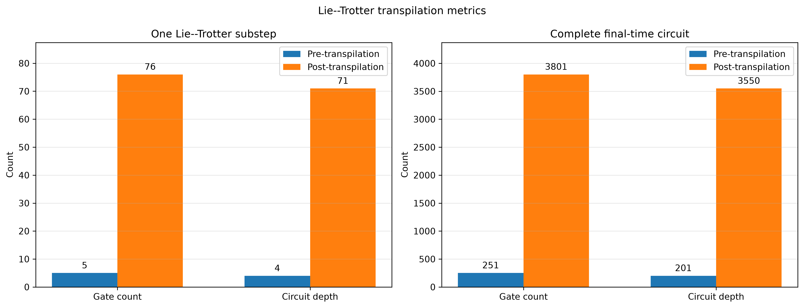
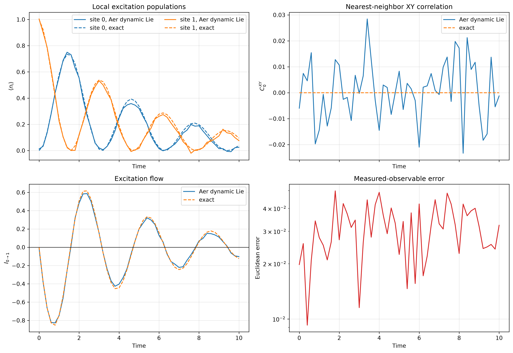
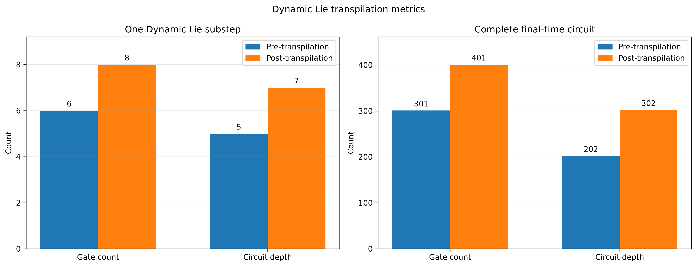
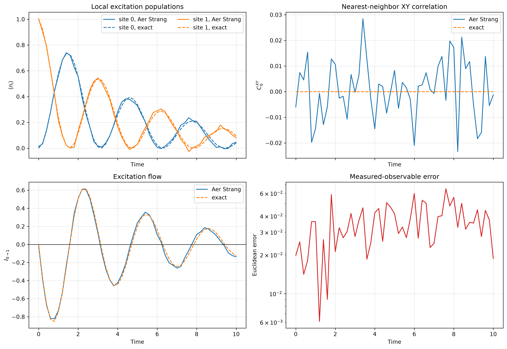
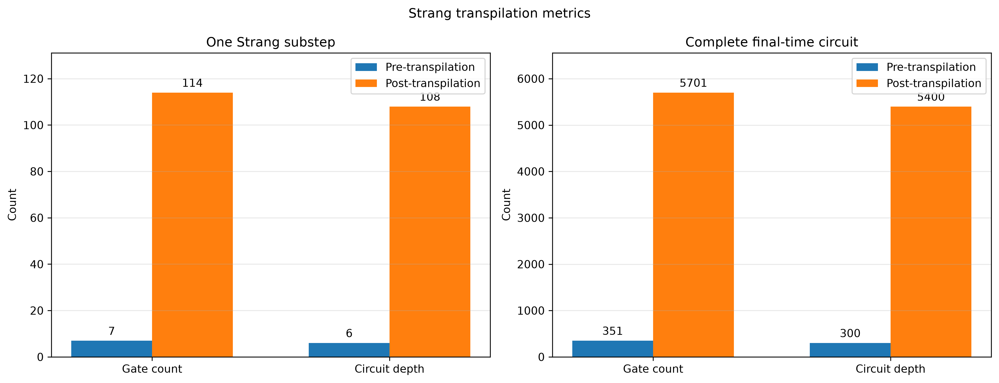

# Experiment 2: Four-qubit circuits for Model Problem I

Experiment 2 implements the $N=2$ instance of Model Problem I on Qiskit Aer.
There are two system qubits and two ancilla qubits encoding the shared
three-level dilation ancilla.

## System and ancilla

The system Hamiltonian and jump operators are

$$
H=\frac{J}{2}(X_0X_1+Y_0Y_1)
  +\frac{h}{2}(Z_0+Z_1),
$$

$$
V_1=\sqrt{\gamma}\,\sigma^-_0,
\qquad
V_2=\sqrt{\gamma}\,\sigma^-_1.
$$

The shared qutrit is encoded using a high bit $a_H$ and low bit $a_L$:

$$
|0\rangle_a=|a_Ha_L\rangle=|00\rangle,
\qquad
|1\rangle_a=|01\rangle,
\qquad
|2\rangle_a=|10\rangle.
$$

The state $|11\rangle$ is unused. The Qiskit qubit assignment is

| Qiskit qubit | Role |
|---:|---|
| $q_0$ | system site 1, $s_1$ |
| $q_1$ | system site 0, $s_0$ |
| $q_2$ | ancilla low bit, $a_L$ |
| $q_3$ | ancilla high bit, $a_H$ |

The reversed system-qubit assignment accounts for Qiskit's $|q_1q_0\rangle$
basis convention while preserving the site ordering in `library/classical.py`.

## Dilation terms

For a physical time step $\Delta t$, the dimensionless dilation terms are

$$
K_H=\Delta t\,|00\rangle\!\langle00|_a\otimes H,
$$

$$
K_1=\sqrt{\gamma\Delta t}\left(
|01\rangle\!\langle00|_a\otimes\sigma^-_0
+|00\rangle\!\langle01|_a\otimes\sigma^+_0
\right),
$$

$$
K_2=\sqrt{\gamma\Delta t}\left(
|10\rangle\!\langle00|_a\otimes\sigma^-_1
+|00\rangle\!\langle10|_a\otimes\sigma^+_1
\right).
$$

Using

$$
\sigma^+_a\sigma^-_s+\sigma^-_a\sigma^+_s
=\frac12(X_sX_a+Y_sY_a),
$$

the jump terms in the four-qubit encoding become

$$
K_1=
|0\rangle\!\langle0|_{a_H}\otimes
\frac{\sqrt{\gamma\Delta t}}{2}
(X_{s_0}X_{a_L}+Y_{s_0}Y_{a_L}),
$$

$$
K_2=
|0\rangle\!\langle0|_{a_L}\otimes
\frac{\sqrt{\gamma\Delta t}}{2}
(X_{s_1}X_{a_H}+Y_{s_1}Y_{a_H}).
$$

Consequently:

- $e^{-iK_1}$ is an `XXPlusYYGate` between $s_0$ and $a_L$, controlled on
  $a_H=0$;
- $e^{-iK_2}$ is an `XXPlusYYGate` between $s_1$ and $a_H$, controlled on
  $a_L=0$;
- $e^{-iK_H}$ is the system evolution controlled on $a_Ha_L=00$.

The complementary open control on each jump prevents either exchange from
coupling a valid ancilla state to $|11\rangle$.

## Gate angles

Qiskit uses

$$
\operatorname{XXPlusYY}(\theta,0)
=\exp\!\left[-i\frac{\theta}{4}(XX+YY)\right].
$$

Therefore a full step uses

$$
\theta_H=2J\Delta t,
\qquad
\theta_J=2\sqrt{\gamma\Delta t}.
$$

The field factors are controlled `RZ` gates with angle $h\Delta t$, since
$R_Z(\phi)=e^{-i\phi Z/2}$. With the configured values
$J=1$, $\gamma=0.2$, and $\Delta t=0.2$,

$$
\theta_H=0.4,
\qquad
\theta_J=0.4.
$$

## Lie circuit

The chronological order of one Lie step is

$$
K_H\longrightarrow K_1\longrightarrow K_2.
$$

Equivalently,

$$
U_{\mathrm{Lie}}
=e^{-iK_2}e^{-iK_1}e^{-iK_H}.
$$

After all three factors, both ancilla qubits are reset. This implements the
partial trace of the shared ancilla and prepares $|00\rangle_a$ for the next
time step.



## Dynamic Lie circuit

[`dynamic_lie_trotter.py`](dynamic_lie_trotter.py) uses the reset guarantee
to remove the expensive quantum controls. At the beginning of every step,
$a_L=a_H=0$. Therefore:

1. $K_H$ can be applied directly to the two system qubits;
2. $K_1$ can be applied directly to $(s_0,a_L)$ because $a_H$ is still
   zero; and
3. $a_L$ is measured after $K_1$, and an `if_test` applies the otherwise
   uncontrolled $K_2$ exchange to $(s_1,a_H)$ only when the measurement is
   zero.

The chronological sequence is

$$
K_H\longrightarrow K_1\longrightarrow
\operatorname{measure}(a_L)\longrightarrow
\left\{
\begin{array}{ll}
K_2,&c=0,\\
I,&c=1,
\end{array}
\right.
\longrightarrow\operatorname{reset}(a_L,a_H).
$$

The measurement must be between $K_1$ and $K_2$. A measurement after
$K_2$ cannot supply the classical condition for a gate that has already
executed.

To see why the intermediate measurement is exact for the reduced system,
let $\Pi_b=|b\rangle\!\langle b|_{a_L}$ and let $\rho'$ be the joint state
after $K_H$ and $K_1$. The original open-controlled second jump is

$$
\widetilde U_2=\Pi_0U_2+\Pi_1I.
$$

After tracing out the ancilla, its cross terms vanish because
$\Pi_0\Pi_1=0$:

$$
\operatorname{Tr}_a(\widetilde U_2\rho'\widetilde U_2^\dagger)
=\sum_{b=0}^1\operatorname{Tr}_a\!\left[
U_2^{(b)}\Pi_b\rho'\Pi_bU_2^{(b)\dagger}
\right],
$$

where $U_2^{(0)}=U_2$ and $U_2^{(1)}=I$. The expression on the right is
exactly the measurement-and-feed-forward channel. Thus the optimization
changes the implementation, not the reduced Lie-dilation map.



## Symmetric circuit

To keep the system evolution in the middle and the boundary jumps on its
two sides, one symmetric step is

$$
U_{\mathrm{sym}}
=e^{-iK_1/2}e^{-iK_2/2}e^{-iK_H}
 e^{-iK_2/2}e^{-iK_1/2}.
$$

Its chronological circuit order is

$$
K_1/2\longrightarrow K_2/2\longrightarrow K_H
\longrightarrow K_2/2\longrightarrow K_1/2.
$$

The full Hamiltonian angle is $2J\Delta t$, and every jump half-step angle
is $\sqrt{\gamma\Delta t}$. The ancilla reset again occurs only after the
complete sequence.



## Numerical verification

The reduced system density matrix from each one-step Qiskit circuit was
compared directly with `classical.hamiltonian_dilation_evolve`:

| Formula | One-step Frobenius difference |
|---|---:|
| Lie | $2.99\times10^{-15}$ |
| Dynamic Lie | below $10^{-12}$ |
| Symmetric | $4.78\times10^{-15}$ |

These differences are floating-point roundoff.

The complete 51-point Aer calculations use estimator precision
$1/\sqrt{8192}$. Measurements, resets, and the classical `if_test` region
are included in the operation counts. Qiskit's `size()` treats an entire
control-flow region as one operation; the conditional body is still
transpiled and executed when its condition is satisfied.

| Circuit | Pre-transpilation gates | Pre depth | Post-transpilation gates | Post depth |
|---|---:|---:|---:|---:|
| One Lie step | 5 | 4 | 76 | 71 |
| Full Lie circuit | 251 | 201 | 3801 | 3550 |
| One dynamic Lie step | 6 | 5 | 8 | 7 |
| Full dynamic Lie circuit | 301 | 202 | 401 | 302 |
| One symmetric step | 7 | 6 | 114 | 108 |
| Full symmetric circuit | 351 | 300 | 5701 | 5400 |

For the regenerated dynamic Lie Aer calculation, the maximum aggregate
observable error is $4.980\times10^{-2}$ relative to exact Lindblad
evolution and $4.893\times10^{-2}$ relative to the coherent Lie dilation.
The latter is estimator sampling uncertainty; the exact channel comparison
above verifies that the coherent and dynamic reduced maps agree.

For the regenerated symmetric Aer calculation, the maximum aggregate
observable error relative to exact Lindblad evolution is
$6.513\times10^{-2}$, and the final-time error is $1.873\times10^{-2}$.













Run the calculations from the repository root with

```bash
uv run python Model1/Experiment2/unitary_lie_trotter.py
uv run python Model1/Experiment2/dynamic_lie_trotter.py
uv run python Model1/Experiment2/unitary_strang_trotter.py
```
