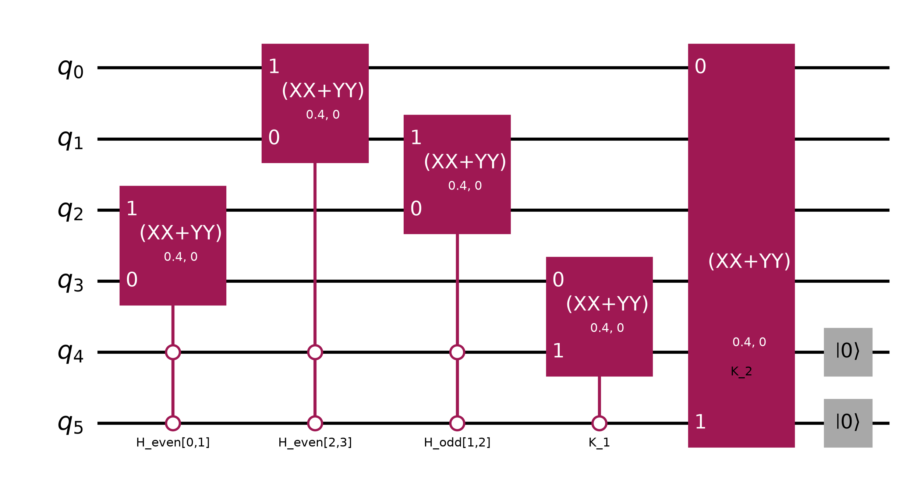
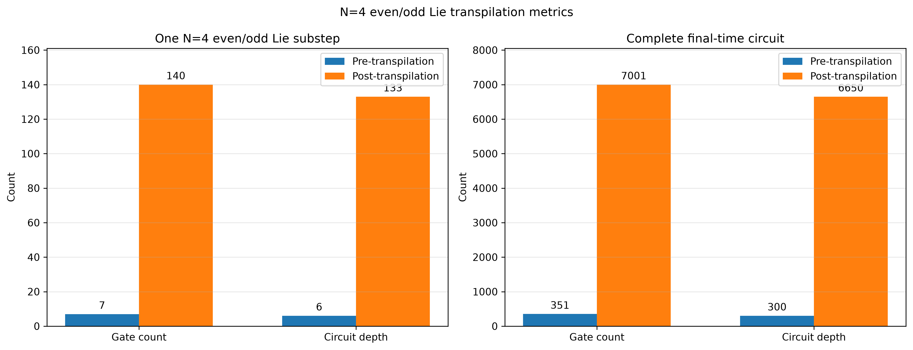
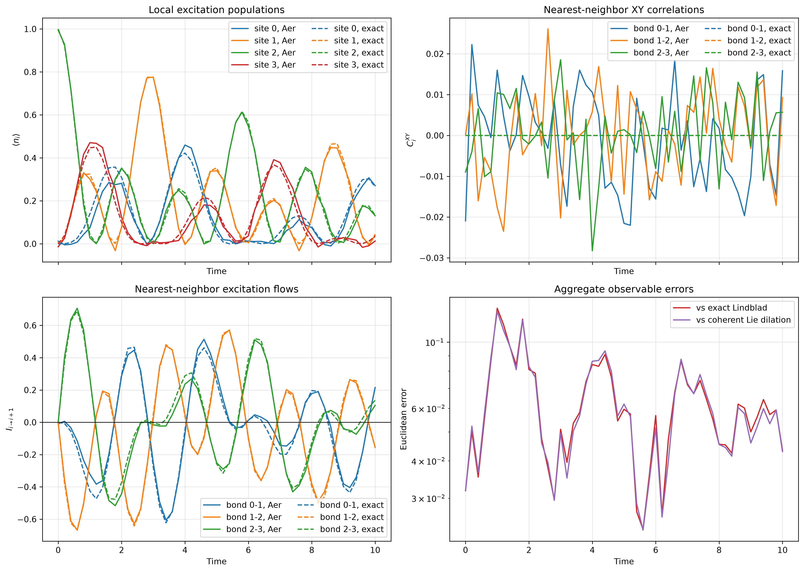
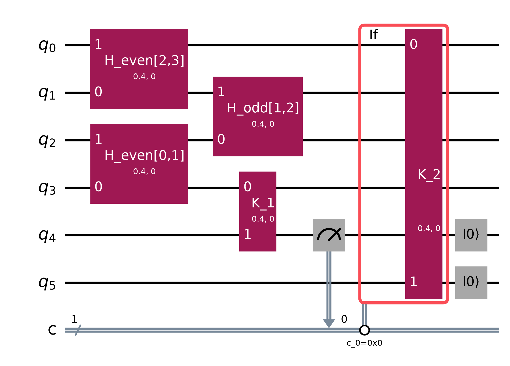
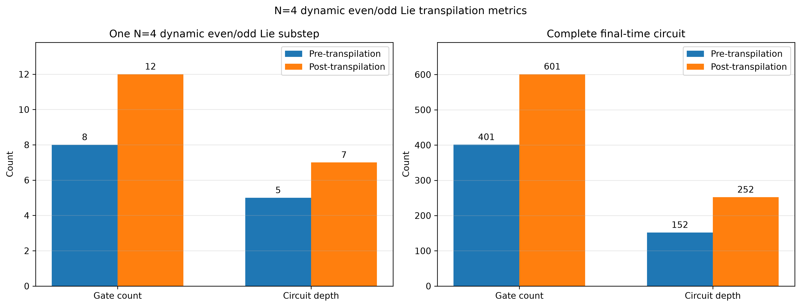
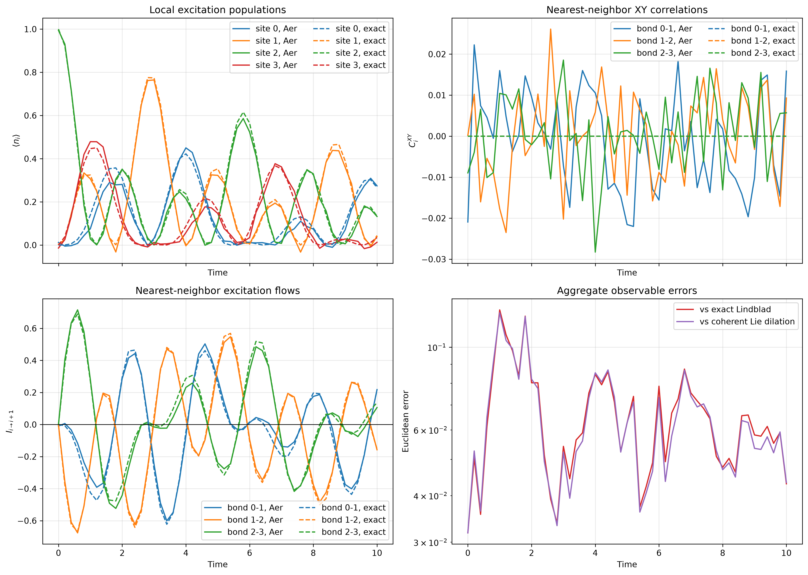
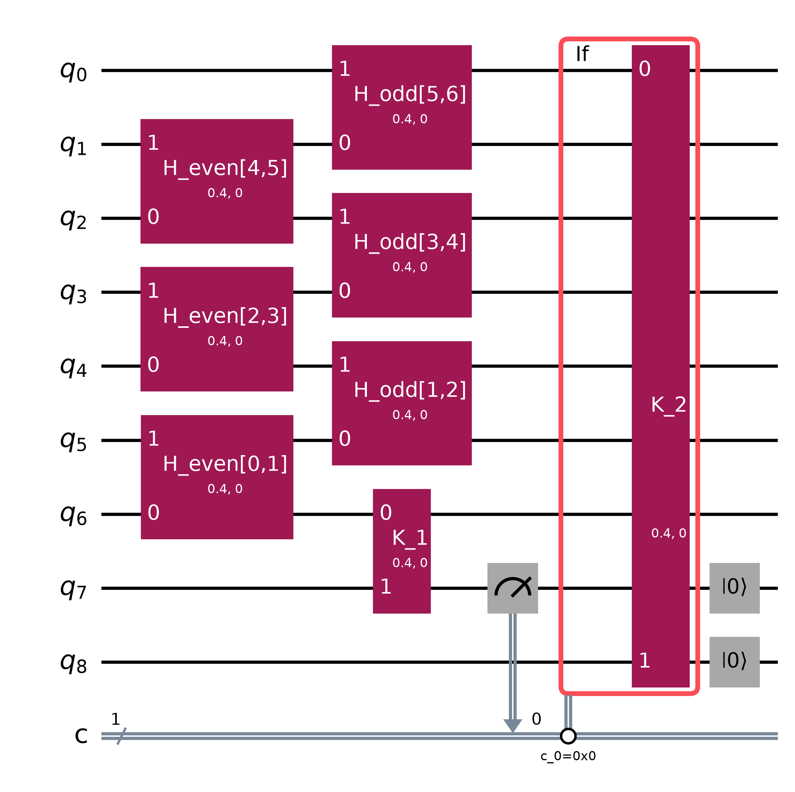
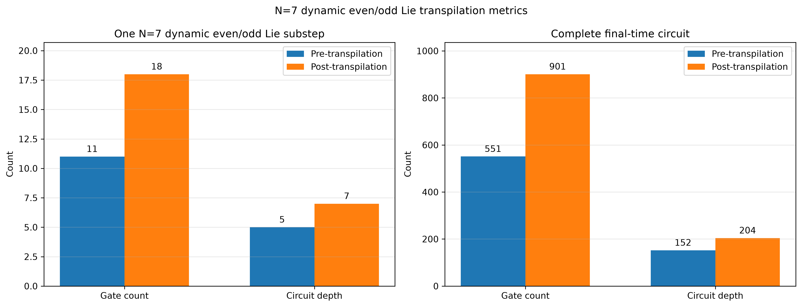
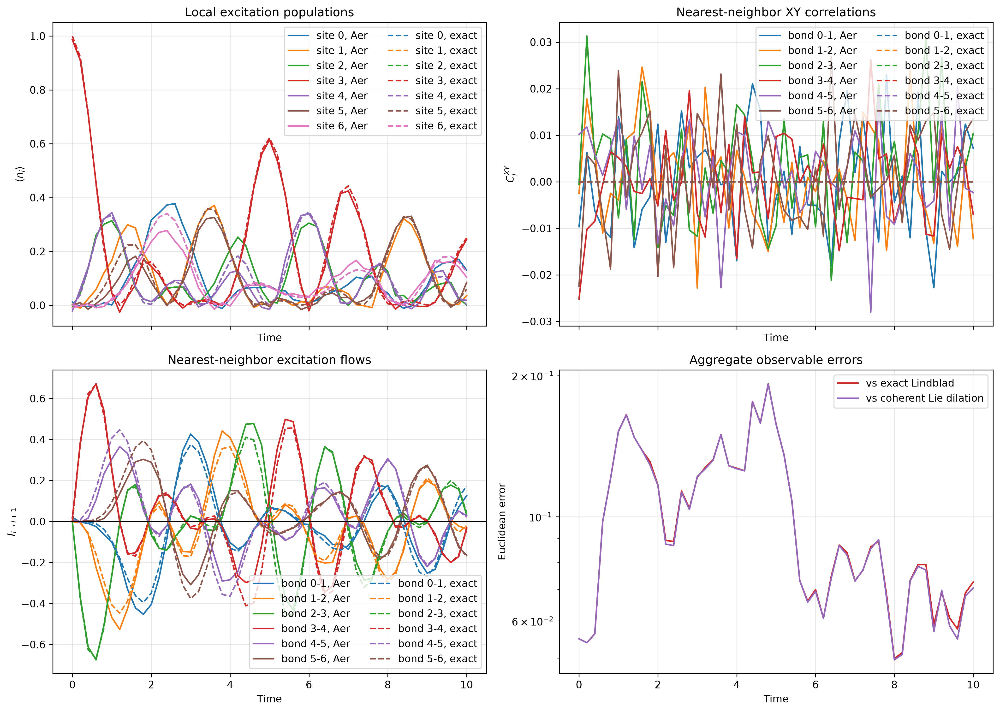

# Experiment 3: General-$N$ Lie circuits

Experiment 3 extends the four-qubit construction in Experiment 2 to an
arbitrary open chain of $N\geq2$ system qubits. As in Model Problem I, there
are exactly two jump operators, both at the boundaries:

$$
H=\frac{J}{2}\sum_{n=0}^{N-2}
(X_nX_{n+1}+Y_nY_{n+1})
+\frac{h}{2}\sum_{n=0}^{N-1}Z_n,
$$

$$
V_1=\sqrt{\gamma}\,\sigma^-_0,
\qquad
V_2=\sqrt{\gamma}\,\sigma^-_{N-1}.
$$

The circuit uses $N+2$ qubits: $N$ system qubits and two qubits encoding
the shared qutrit ancilla,

$$
|0\rangle_a=|00\rangle,
\qquad |1\rangle_a=|01\rangle,
\qquad |2\rangle_a=|10\rangle.
$$

The state $|11\rangle_a$ remains unused. Site $n$ maps to Qiskit qubit
$q_{N-1-n}$, while $q_N=a_L$ and $q_{N+1}=a_H$.

## Even--odd system decomposition

For $N>2$, the system exchange Hamiltonian cannot be represented by one
two-qubit gate. Split its bonds according to the parity of their left site:

$$
H_{\mathrm{even}}
=\frac{J}{2}\sum_{\substack{n=0\\n\ \mathrm{even}}}^{N-2}
(X_nX_{n+1}+Y_nY_{n+1}),
$$

$$
H_{\mathrm{odd}}
=\frac{J}{2}\sum_{\substack{n=0\\n\ \mathrm{odd}}}^{N-2}
(X_nX_{n+1}+Y_nY_{n+1}).
$$

Two different bonds in the same layer have disjoint support. Hence

$$
[H_n,H_m]=0
\quad\text{within each parity layer},
$$

and the exponential of a layer factorizes exactly into one
`XXPlusYYGate` per bond. The two complete layers generally do not commute:

$$
[H_{\mathrm{even}},H_{\mathrm{odd}}]\ne0.
$$

The system factor is therefore approximated by one first-order product per
physical dilation step:

$$
e^{-iK_H}
\approx e^{-iK_{H,\mathrm{odd}}}
e^{-iK_{H,\mathrm{even}}}.
$$

Chronologically, the even layer is applied first and the odd layer second.
There is no separate inner system-Trotter loop. Reducing the physical
dilation step automatically reduces both the outer dilation splitting error
and this even--odd splitting error.

The uniform field layer is represented by controlled `RZ` factors. It is
absent for the configured value $h=0$.

## Complete shared-ancilla step

For $P_0=|00\rangle\!\langle00|_a$, the controlled system layers are

$$
K_{H,p}=\Delta t\,P_0\otimes H_p,
\qquad p\in\{\mathrm{even},\mathrm{odd}\}.
$$

Every bond factor is an `XXPlusYYGate` promoted to an open-controlled gate
on $a_La_H=00$. The controls retain the fully unitary shared-ancilla
representation used by `unitary_lie_trotter.py` in Experiment 2.

The boundary jump factors remain

$$
K_1=
|0\rangle\!\langle0|_{a_H}\otimes
\frac{\sqrt{\gamma\Delta t}}{2}
(X_{s_0}X_{a_L}+Y_{s_0}Y_{a_L}),
$$

$$
K_2=
|0\rangle\!\langle0|_{a_L}\otimes
\frac{\sqrt{\gamma\Delta t}}{2}
(X_{s_{N-1}}X_{a_H}+Y_{s_{N-1}}Y_{a_H}).
$$

Thus one circuit step is applied chronologically as

$$
K_{H,\mathrm{even}}\longrightarrow
K_{H,\mathrm{odd}}\longrightarrow
K_1\longrightarrow K_2
\longrightarrow\operatorname{reset}(a_L,a_H).
$$

Equivalently, the product unitary before the reset is

$$
U_{\mathrm{step}}=
e^{-iK_2}e^{-iK_1}
e^{-iK_{H,\mathrm{odd}}}e^{-iK_{H,\mathrm{even}}}.
$$

The ancilla is reset only after all four factors. The two jump factors
therefore continue to use one shared dilation ancilla.

## Dynamic Lie optimization

[`dynamic_lie_trotter.py`](dynamic_lie_trotter.py) uses the ancilla reset at
the end of every step to remove the quantum controls from the next step.
Immediately before the system layers, the ancilla is guaranteed to be
$|00\rangle_a$. Therefore every bond in $H_{\mathrm{even}}$ and
$H_{\mathrm{odd}}$ can be implemented by an ordinary `XXPlusYYGate`, and
the optional field terms can be implemented by ordinary `RZ` gates.

The first jump changes only $s_0$ and $a_L$. Because $a_H$ is still known to
be zero at this point, its open control can also be removed. After $K_1$,
$a_L$ is measured and the second boundary exchange is applied only on the
zero outcome. One dynamic step is consequently

$$
H_{\mathrm{even}}\longrightarrow H_{\mathrm{odd}}
\longrightarrow H_{\mathrm{field}}\longrightarrow K_1
\longrightarrow\operatorname{measure}(a_L)
\longrightarrow
\left\{
\begin{array}{ll}
K_2,&c=0,\\
I,&c=1,
\end{array}
\right.
\longrightarrow\operatorname{reset}(a_L,a_H).
$$

This feed-forward replacement preserves the reduced system channel. Let
$\Pi_b=|b\rangle\!\langle b|_{a_L}$ and let $\rho'$ denote the joint state
after the system layers and $K_1$. The controlled second jump is

$$
\widetilde U_2=\Pi_0U_2+\Pi_1I.
$$

After the ancilla is discarded, coherences between the orthogonal
$a_L=0$ and $a_L=1$ sectors vanish. Hence

$$
\operatorname{Tr}_a(\widetilde U_2\rho'\widetilde U_2^\dagger)
=\sum_{b=0}^1\operatorname{Tr}_a\!\left[
U_2^{(b)}\Pi_b\rho'\Pi_bU_2^{(b)\dagger}
\right],
$$

where $U_2^{(0)}=U_2$ and $U_2^{(1)}=I$. The right-hand side is exactly the
measurement-and-classical-feed-forward channel.

## Gate angles

Using Qiskit's convention

$$
\operatorname{XXPlusYY}(\theta,0)
=\exp\!\left[-\frac{i\theta}{4}(XX+YY)\right],
$$

every system bond uses

$$
\theta_H=2J\Delta t,
$$

and each full boundary-jump factor uses

$$
\theta_J=2\sqrt{\gamma\Delta t}.
$$

For $J=1$, $\gamma=0.2$, and $\Delta t=0.2$, both angles are $0.4$.

## Verification

The one-step $N=3$ unitary circuit was compared against an explicit matrix
product of the even, odd, and two jump dilation generators. The dynamic
measurement-and-feed-forward circuit was independently compared with the
unitary circuit. All reduced system density matrices agree to an absolute
tolerance of $10^{-12}$.

## $N=4$ unitary Lie results

The default $N=4$ calculation has even bonds $(0,1)$ and $(2,3)$ and odd
bond $(1,2)$. The unitary circuit gives the following transpilation metrics:

| Circuit | Pre operations | Pre depth | Post operations | Post depth |
|---|---:|---:|---:|---:|
| One unitary dilation step | 7 | 6 | 140 | 133 |
| Complete unitary 50-step circuit | 351 | 300 | 7001 | 6650 |

Reset operations are included in these counts. With estimator precision
$1/\sqrt{8192}$, the maximum unitary-circuit aggregate observable error is
$1.299\times10^{-1}$ relative to exact Lindblad evolution and
$1.267\times10^{-1}$ relative to the coherent Lie dilation with an unsplit
system Hamiltonian.







## $N=4$ dynamic Lie results

The dynamic calculation uses the same $N=4$ chain, 51 time points on
$0\leq t\leq10$, $J=1$, $h=0$, $\gamma=0.2$, and one even--odd product per
physical step. Thus $\Delta t=0.2$ and both the system-bond and jump-gate
angles are $0.4$.

Its regenerated transpilation metrics are

| Dynamic circuit | Pre operations | Pre depth | Post operations | Post depth |
|---|---:|---:|---:|---:|
| One dilation step | 8 | 5 | 12 | 7 |
| Complete 50-step circuit | 401 | 152 | 601 | 252 |

Measurements, resets, and the classical `if_test` region are included in
these operation counts. The pre-transpilation step has one more operation
than the unitary step because the ancilla measurement is counted. Removing
the quantum controls nevertheless produces a large reduction after
transpilation:

| Comparison | Unitary | Dynamic |
|---|---:|---:|
| One-step post-transpilation operations | 140 | 12 |
| One-step post-transpilation depth | 133 | 7 |
| Full-circuit post-transpilation operations | 7001 | 601 |
| Full-circuit post-transpilation depth | 6650 | 252 |

The Aer estimator used target precision $1/\sqrt{8192}=0.01104854$. The
maximum reported standard error was also $0.01104854$. The resulting
aggregate observable errors were

| Reference trajectory | Maximum error | Final-time error |
|---|---:|---:|
| Exact Lindblad evolution | $1.259\times10^{-1}$ | $4.301\times10^{-2}$ |
| Coherent Lie dilation with unsplit $H$ | $1.236\times10^{-1}$ | $4.336\times10^{-2}$ |

The comparison with the coherent unsplit trajectory contains both the
even--odd system splitting error and estimator uncertainty. The direct
one-step density-matrix test described above separately verifies that the
dynamic feed-forward optimization does not change the reduced channel of
the corresponding even--odd unitary circuit.







## $N=7$ dynamic Lie results

The $N=7$ calculation uses seven system qubits and the same two-qubit
shared ancilla, for nine circuit qubits in total. The initial excitation is
placed at the central site $n=3$. The even layer contains bonds $(0,1)$,
$(2,3)$, and $(4,5)$, while the odd layer contains bonds $(1,2)$, $(3,4)$,
and $(5,6)$. All three exchanges within a layer act on disjoint pairs and
can therefore be executed in parallel.

The run uses the same 51 time points on $0\leq t\leq10$, $J=1$, $h=0$,
$\gamma=0.2$, and one even--odd product per physical step. Consequently,
$\Delta t=0.2$, both `XXPlusYYGate` angles are $0.4$, and the full
jump-factor exchange probability is $0.03946950$.

The regenerated transpilation metrics are

| Dynamic circuit | Pre operations | Pre depth | Post operations | Post depth |
|---|---:|---:|---:|---:|
| One dilation step | 11 | 5 | 18 | 7 |
| Complete 50-step circuit | 551 | 152 | 901 | 204 |

Measurements, both resets, and the classical `if_test` region are included
in the operation counts. The three extra system bonds relative to the
$N=4$ step increase the one-step pre-transpilation operation count from 8
to 11, while the pre-transpilation depth remains 5 because each parity
layer is parallel.

The Aer estimator again used target precision
$1/\sqrt{8192}=0.01104854$, and its maximum reported standard error was
$0.01104854$. The aggregate observable errors were

| Reference trajectory | Maximum error | Final-time error |
|---|---:|---:|
| Exact Lindblad evolution | $1.923\times10^{-1}$ | $7.263\times10^{-2}$ |
| Coherent Lie dilation with unsplit $H$ | $1.920\times10^{-1}$ | $7.054\times10^{-2}$ |

As in the $N=4$ calculation, these trajectory-level differences include
the even--odd system splitting and finite-precision estimator sampling;
they do not measure a discrepancy between the coherent and dynamic
realizations of the same one-step channel.







## Running

Run the default $N=4$ calculation from the repository root with

```bash
uv run python Model1/Experiment3/unitary_lie_trotter.py
uv run python Model1/Experiment3/dynamic_lie_trotter.py
```

Choose any $N\geq2$ with

```bash
uv run python Model1/Experiment3/unitary_lie_trotter.py --n-qubits 7
uv run python Model1/Experiment3/dynamic_lie_trotter.py --n-qubits 7
```

The output filenames include $N$, so calculations for different chain
lengths do not overwrite one another.
