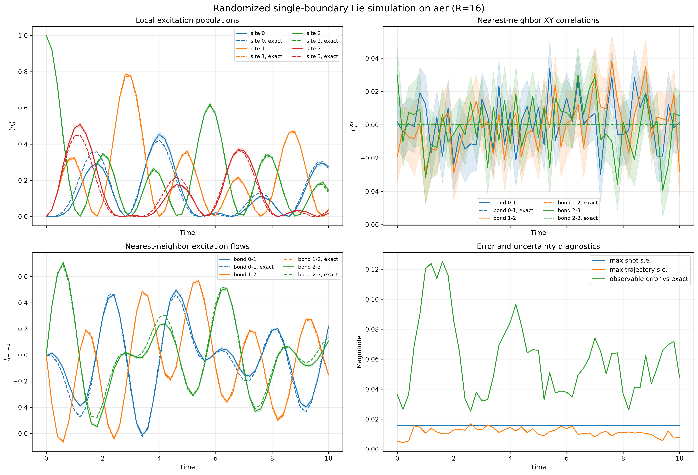
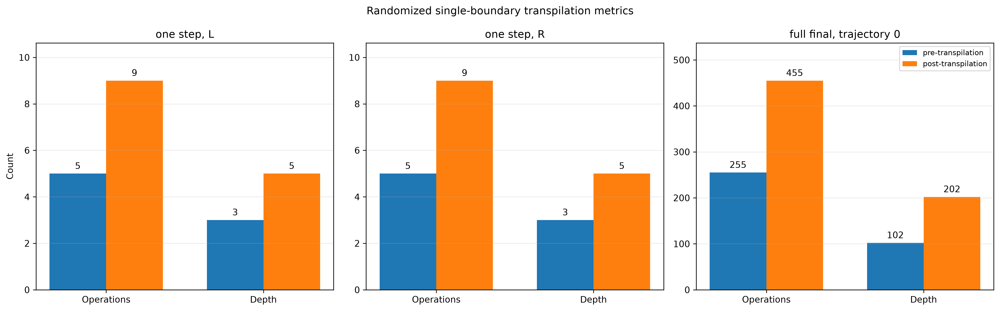
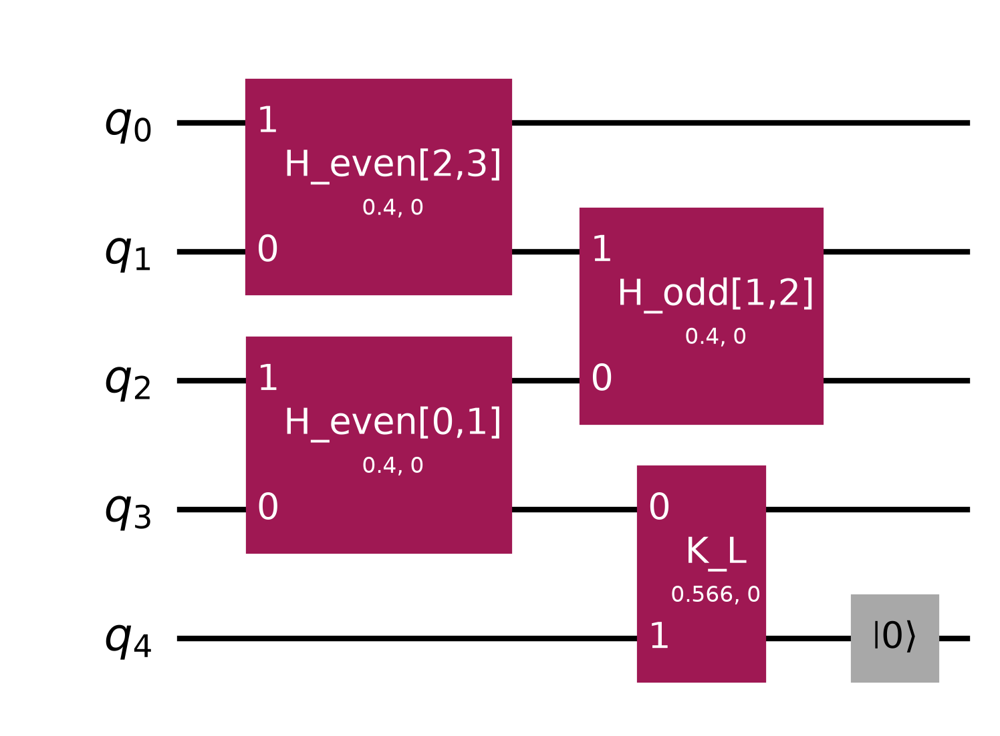
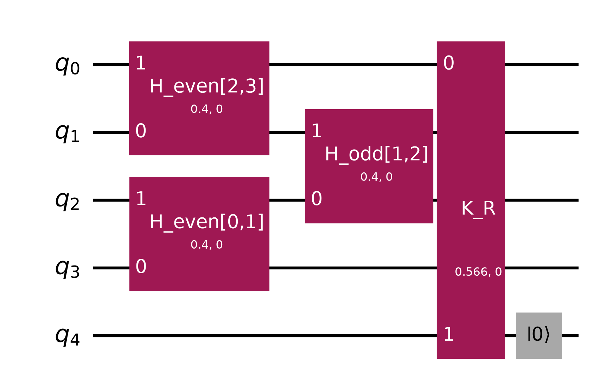

# Experiment 5: Randomized single-boundary dilation

Experiment 5 replaces the two-boundary shared-ancilla construction of
Experiments 3 and 4 with a randomized single-boundary dilation. It follows
the randomized Lindblad product-formula idea of Chen *et al.*, [*A Randomized
Method for Simulating Lindblad Equations and Thermal State Preparation*,
Quantum **9**, 1917 (2025)](https://doi.org/10.22331/q-2025-11-20-1917).

The implementation is
[`randomized_lie_trotter.py`](randomized_lie_trotter.py). It supports local
Aer simulation and IBM hardware, arbitrary system size \(N\geq2\), arbitrary
saved times, a configurable maximum internal Trotter step, and a configurable
number \(R\) of random trajectories.

## Mathematical construction

The target boundary-damped \(XX\) chain is unchanged:

\[
H=\frac{J}{2}\sum_{n=0}^{N-2}
(X_nX_{n+1}+Y_nY_{n+1})
+\frac{h}{2}\sum_{n=0}^{N-1}Z_n,
\]

\[
V_L=\sqrt{\gamma}\,\sigma^-_0,
\qquad
V_R=\sqrt{\gamma}\,\sigma^-_{N-1},
\]

\[
\mathcal L=\mathcal L_H+\mathcal D[V_L]+\mathcal D[V_R],
\qquad
\mathcal L_H(\rho)=-i[H,\rho].
\]

Define two simple generators,

\[
\mathcal L_L=\mathcal L_H+2\mathcal D[V_L],
\qquad
\mathcal L_R=\mathcal L_H+2\mathcal D[V_R].
\]

A uniform random choice \(B\in\{L,R\}\) then satisfies

\[
\mathbb E_B[\mathcal L_B]
=\frac{\mathcal L_L+\mathcal L_R}{2}
=\mathcal L.
\]

The factor of two is essential. Since

\[
\mathcal D[\sqrt2 V]=2\mathcal D[V],
\]

the selected boundary jump is \(\sqrt2 V_B\), not \(V_B\). The ordinary
boundary-dilation angle \(2\sqrt{\gamma\,dt}\) is consequently replaced by

\[
\boxed{\theta_{\mathrm{rand}}=2\sqrt{2\gamma\,dt}}.
\]

Selecting one original jump with the unscaled angle would simulate only half
of the desired boundary dissipation on average.

For every internal substep, the script:

1. applies the mutually commuting even \(XX+YY\) bonds;
2. applies the mutually commuting odd \(XX+YY\) bonds;
3. classically samples \(B=L\) or \(R\) with probability \(1/2\);
4. applies one `XXPlusYYGate` between boundary \(B\) and one ancilla, with
   angle \(2\sqrt{2\gamma\,dt}\); and
5. resets that ancilla to \(|0\rangle\).

The random choice is made while constructing the circuit. It is therefore
ordinary classical randomization between circuits, not a coherent quantum
control and not an IBM dynamic `if_test`.

## Circuit resources

Each randomized trajectory uses

\[
N\text{ system qubits}+1\text{ resettable ancilla}=N+1\text{ qubits}.
\]

There is no mid-circuit measurement and no classical feed-forward. Reset is
still required because it implements tracing out the dilation ancilla and
prepares it for the next substep.

For \(h=0\), excluding initial-state preparation and final observable
measurements, one substep contains

- \(N-1\) system-bond operations;
- one boundary-jump operation; and
- one reset operation.

Thus the logical operation count is \(N+1\) per substep. The Experiment 4
dynamic construction has \(N+4\) operations under the same convention and
uses \(N+2\) qubits. More importantly for real hardware, the randomized
circuit eliminates the mid-circuit measurement and conditional second jump.
The actual post-transpilation saving remains backend- and layout-dependent,
so the script records both logical and compiled operation counts and depths.

## Meaning and choice of \(R\)

\(R\) is the number of independently sampled, complete boundary-choice
trajectories. It is not the number of Trotter steps and it is not the number
of hardware shots. One trajectory is a complete sequence such as

\[
(L,R,R,L,\ldots)
\]

over every internal substep up to the largest saved time.

The script generates \(R\) paths from `--seed-trajectories`. Earlier saved
times reuse prefixes of those same paths, and all five measurement bases use
the same path for a given trajectory. This coupling avoids adding unrelated
randomization when comparing times or observable bases.

The default is

```text
R = 16
```

because it is a useful middle ground for Aer and moderate hardware studies.
Recommended use is:

- use \(R=8\) for an initial IBM pilot;
- use \(R=16\) for the standard run; and
- on Aer, compare \(R\in\{1,2,4,8,16,32,64\}\) and retain the smallest value
  whose trajectory standard error is below the desired tolerance.

For an observable \(O\), the trajectory mean is

\[
\bar O_R=\frac1R\sum_{r=1}^R O_r.
\]

The script reports three uncertainties:

- shot standard error, propagated through the mean over trajectories;
- trajectory standard error, estimated from the between-trajectory sample
  variance after subtracting the mean analytic shot variance and clipping at
  zero; and
- total standard error, the quadrature sum of those two components.

Increasing \(R\) decreases Monte Carlo trajectory uncertainty approximately
as \(R^{-1/2}\), but it does not remove finite-\(dt\) product-formula bias.
Decrease `--trotter-delta-t` to control that bias. Moreover, this loss-only
model has a pure vacuum invariant state, so typical-single-realization bounds
in the cited paper that assume a full-rank invariant state do not directly
justify \(R=1\). The averaged-channel result and explicit convergence in
\(R\) are the safer basis for this experiment.

## Shot convention and workload size

`--shots` is the total shot budget for one saved time and one measurement
basis after averaging all trajectories. It is divided evenly among the
\(R\) circuits. Therefore

```bash
--shots 8192 --trajectories 16
```

uses 512 shots for each randomized circuit. `--shots` must be divisible by
`--trajectories`; the script rejects ambiguous allocations.

With five measurement bases, the circuit count is

\[
5\times(\text{saved times})\times R.
\]

For 51 times this gives:

| \(R\) | Circuits | Shots per circuit when `--shots 8192` |
|---:|---:|---:|
| 4 | 1,020 | 2,048 |
| 8 | 2,040 | 1,024 |
| 16 | 4,080 | 512 |
| 32 | 8,160 | 256 |

The total shot count remains fixed when \(R\) changes under this convention,
but provider overhead grows because there are more distinct circuits.

## Trotter resolution

`--trotter-delta-t` is a maximum internal step size. Saved times need not be
multiples of it. For example,

```bash
--times 0 0.7 --trotter-delta-t 0.2
```

uses substeps \((0.2,0.2,0.2,0.1)\). Each substep independently samples one
boundary and uses its own angles \(2J\,dt\) and \(2\sqrt{2\gamma\,dt}\). If
the option is omitted, each saved-time interval is one substep.

A single nonnegative `--times` value produces only that saved-time circuit:

```bash
uv run python Model1/Experiment5/randomized_lie_trotter.py \
  --times 0.8 \
  --trotter-delta-t 0.2
```

produces only the (t=0.8) trajectory circuits. Every circuit prepares the
initial state and then contains four substeps of size 0.2. No separate
circuits are generated at (t=0, 0.2, 0.4,) or (0.6). Use
`--times 0 0.8` when a separately executed (t=0) baseline is wanted.

## Running on Aer

The default \(N=4,\ R=16\) run is

```bash
uv run python Model1/Experiment5/randomized_lie_trotter.py \
  --backend aer \
  --classical-reference
```

A short test is

```bash
uv run python Model1/Experiment5/randomized_lie_trotter.py \
  --n-qubits 4 \
  --backend aer \
  --trajectories 4 \
  --shots 1024 \
  --times 0 0.2 0.4 0.8 \
  --trotter-delta-t 0.1 \
  --classical-reference
```

To perform the recommended convergence study, run the same command with the
same time grid, Trotter step, and total shot budget for each desired \(R\).
Use a fixed `--seed-trajectories` when comparing a nested prefix of the seeded
ensemble. The output JSON stores every path explicitly.

## Running on IBM hardware

For a small pilot on `ibm_kingston`:

```bash
uv run python Model1/Experiment5/randomized_lie_trotter.py \
  --n-qubits 4 \
  --backend ibm_kingston \
  --trajectories 8 \
  --shots 8192 \
  --times 0 0.2 0.4 \
  --trotter-delta-t 0.1 \
  --batch-size 5
```

Any non-`aer` backend submits real QPU work. Credentials are read from
`IBMRuntime/apikey.json` by default. The selected backend needs at least
\(N+1\) qubits and reset support; unlike Experiment 4, it does not need
mid-circuit measurement or conditional-gate support.

The hardware default batch size is five circuits. The script does not
automatically bisect a failed batch. Reduce `--batch-size` yourself and add
`--resume` to continue from the last atomically saved checkpoint.

## Outputs and metrics

Every complete run writes the following under `Model1/Experiment5` unless
`--output-directory` is supplied:

- a four-panel observable and uncertainty figure;
- a transpilation figure for a left one-step circuit, a right one-step
  circuit, and a representative full final-time circuit;
- separate untranspiled one-step circuit diagrams for left and right choices;
- a JSON result containing paths, raw counts, trajectory-resolved
  observables, averaged observables, uncertainty components, provider job
  IDs, and per-circuit compilation metrics; and
- an atomically updated checkpoint JSON.

Operation counts include reset and measurement operations. The one-step
metrics contain the physical substep including reset but no terminal
observable measurements. The full-circuit metrics include state preparation,
all substeps and resets, basis rotations, and terminal measurements.

## Incremental time archive

The result JSON and observable figure accumulate compatible runs. For
example, running first with `--times 0.8` and later with `--times 1.0` leaves
both saved times in the same result:

```text
times: [0.8, 1.0]
```

If `--times 0.8` is run again, the new counts, observable estimates,
uncertainties, and circuit metrics replace the old \(t=0.8\) records. The
\(t=1.0\) records remain unchanged. Times are sorted after every merge, and
the observable figure is regenerated from the complete archive. The
transpilation figure and one-step circuit diagrams describe the latest run;
the JSON `run_history` retains every run's schedule and transpilation summary.

Merging is allowed only when the backend, \(N\), \(R\), total shot budget,
measurement bases, compiler settings, random seeds, Aer method, maximum
Trotter step, and classical-reference setting match. An incompatible run is
rejected before circuit submission; use a different `--output-directory` for
such a run.

There is one default `*_checkpoint.json`, representing the currently active
run. Starting a different run replaces that temporary checkpoint, but it does
not remove any completed time from the cumulative result JSON. Use `--resume`
to finish an interrupted run before starting another configuration. An
explicit `--checkpoint-file` still uses the exact path supplied by the user.

## Standard Aer result

The checked-in standard result uses \(N=4\), \(R=16\), 51 saved times from
zero through 10, one \(dt=0.2\) randomized substep per saved-time interval,
and 8192 total shots per time/basis (512 per trajectory circuit). It contains
4,080 sampled circuits. The aggregate observable error relative to the exact
Lindblad solution is \(1.252\times10^{-1}\) at its maximum and
\(4.768\times10^{-2}\) at the final time. These values combine finite-step
bias, finite-\(R\) sampling, and shot noise; they are not a pure Trotter-error
measurement. The largest reported shot and trajectory standard errors are
\(1.562\times10^{-2}\) and \(1.690\times10^{-2}\), respectively.



The representative transpilation metrics on Aer at optimization level 1 are:

| Circuit | Pre operations | Pre depth | Post operations | Post depth |
|---|---:|---:|---:|---:|
| one randomized step, left | 5 | 3 | 9 | 5 |
| one randomized step, right | 5 | 3 | 9 | 5 |
| full final-time \(Z\)-basis circuit, trajectory 0 | 255 | 102 | 455 | 202 |



The two possible single-substep circuits are shown separately because the
boundary selection is classical and occurs before circuit execution:





## Recovery and metadata-only mode

The checkpoint is updated after every completed batch. Resume an interrupted
run with the exact same physical and compiler options plus `--resume`.

If completed jobs must be reconstructed from IBM Runtime, use the read-only
recovery script. Explicit job IDs in oldest-to-newest order are safest:

```bash
uv run python Model1/Experiment5/recover_randomized_lie_trotter.py \
  --n-qubits 4 \
  --backend ibm_kingston \
  --trajectories 8 \
  --times 0 0.2 0.4 \
  --trotter-delta-t 0.1 \
  --job-id FIRST_JOB_ID \
  --job-id SECOND_JOB_ID
```

The recovery utility never submits or cancels work. Retrieved IBM results do
not retain compilation counts and depths, so those values are recorded as
`-1`. Fill them without executing circuits by running

```bash
uv run python Model1/Experiment5/randomized_lie_trotter.py \
  --metadata-only \
  --metadata-file Model1/Experiment5/results/RECOVERED_FILE.json
```

Metadata-only mode rebuilds the seeded paths, fetches the selected backend's
current target, and transpiles locally. It submits zero Sampler jobs and
creates a `*.before_metadata.json` backup before updating the file. Compiled
metrics obtained later can differ from the historical job if the backend
target or calibration has changed.
