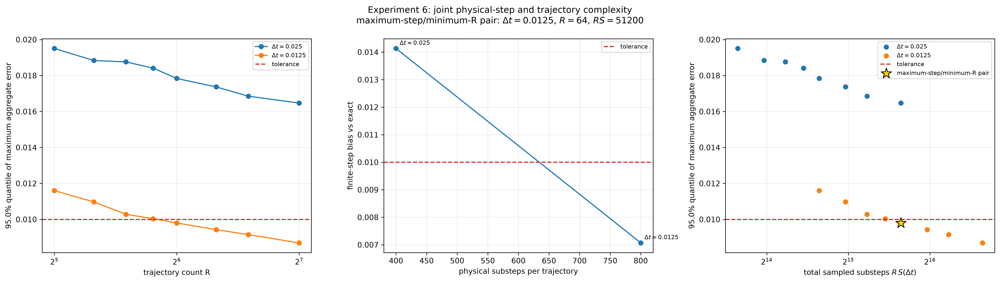
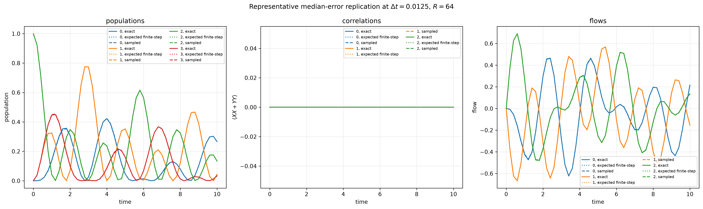
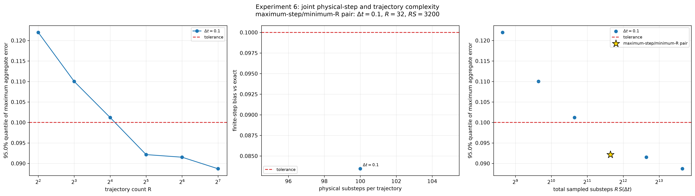
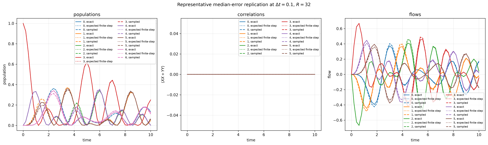

# Experiment 6: Classical sample complexity of the randomized boundary method

Experiment 6 jointly determines the physical Trotter resolution and number of
independently randomized trajectories needed by the Experiment 5
single-boundary method for its particular initial state and observables. It is
entirely classical: it evolves reduced states and density matrices directly, adds no
measurement-shot noise, constructs no circuits, and does not contact Aer or
IBM hardware.

The implementation is
[`classical_sample_complexity.py`](classical_sample_complexity.py).

## Problem held fixed

The model and parameters are the same as Experiment 5,

\[
H=\frac{J}{2}\sum_{n=0}^{N-2}(X_nX_{n+1}+Y_nY_{n+1})
+\frac{h}{2}\sum_{n=0}^{N-1}Z_n,
\qquad
V_L=\sqrt{\gamma}\,\sigma^-_0,
\qquad
V_R=\sqrt{\gamma}\,\sigma^-_{N-1},
\]

with \(J=1\), \(h=0\), and \(\gamma=0.2\). The initial state has one
excitation at site \(\lfloor N/2\rfloor\). The measured observable families
are also unchanged:

- populations \(n_i=(I-Z_i)/2\);
- nearest-neighbor exchange correlations
  \(X_iX_{i+1}+Y_iY_{i+1}\); and
- nearest-neighbor particle flows.

## Randomized finite-step channel

At every physical substep, Experiment 6 applies the even system-bond layer,
the odd layer, and then selects the left or right boundary uniformly. The
selected amplitude-damping channel uses the Experiment 5 enhanced jump
\(\sqrt{2}V_B\), equivalently the dilation angle

\[
\theta_B=2\sqrt{2\gamma\,dt}.
\]

The two boundary outcomes are propagated as exact Kraus maps. This is the
reduced system channel of the ancilla exchange and reset, so no ancilla or
circuit simulation is necessary.

Every requested observation time is evolved independently from \(t=0\).
Observation times therefore specify only where errors are evaluated; they do
not constrain the candidate Trotter step. For example, at \(t=0.8\),
\(\Delta t=0.3\) produces the substeps \((0.3,0.3,0.2)\), even if another
observable is requested at \(t=0.2\).

Because the initial state contains one excitation, the system Hamiltonian
conserves excitation number, and the jumps only remove excitations, a
conditional trajectory has the exact form

\[
\rho_r=p_{0,r}|\mathrm{vac}\rangle\!\langle\mathrm{vac}|
+|\psi_r\rangle\!\langle\psi_r|,
\]

where \(|\psi_r\rangle\) is an unnormalized vector in the \(N\)-dimensional
single-excitation sector. The implementation propagates this vector rather
than a \(2^N\times2^N\) density matrix for each trajectory. All Experiment 5
observables conserve excitation number, so this reduction is exact, not an
additional approximation. The unsplit Lindblad reference is still evaluated
in the full Hilbert space.

## Joint sample complexity

There are two competing resources:

\[
R=\text{number of independently randomized complete trajectories averaged},
\]

and

\[
S(\Delta t)=\text{number of physical substeps needed to reach the final time}.
\]

The total sampled-substep cost is reported as

\[
 C(\Delta t,R)=R\,S(\Delta t).
\]

Decreasing \(\Delta t\) lowers finite-step product-formula and dilation bias,
but makes every trajectory longer. Increasing \(R\) reduces Monte Carlo error,
but requires more complete trajectories. The requested optimization is
lexicographic: select the largest admissible \(\Delta t\), then select the
smallest admissible \(R\) at that step. The cost \(C\) is a diagnostic, not the
selection rule.

For every candidate \((\Delta t,R)\), the script performs many independent
replications. At fixed \(\Delta t\) and target time, the ensembles are nested:
the \(R=8\) estimate uses the first eight paths of the same pool used by
\(R=16\). Random paths for different observation times are independent. This
makes differences between adjacent \(R\) values less noisy without coupling
the Trotter schedule to the observation grid.

## Exact reference and error floor

The primary reference is the unsplit Lindblad solution

\[
\rho(t)=e^{t\mathcal L}\rho(0).
\]

The script also propagates the exact mean of the finite-step randomized
channel by replacing every random boundary choice with the average of its two
possible reduced channels. Its difference from the Lindblad reference is the
finite-\(dt\) bias floor. Increasing \(R\) can reduce trajectory Monte Carlo
error, but cannot reduce this floor; `--trotter-delta-ts` must include smaller values for
that purpose.

At every time, the aggregate observable error is

\[
\epsilon_{\mathrm{agg}}(t)=
\sqrt{\sum_O
\left(\langle O\rangle_{\mathrm{sampled}}(t)
-\langle O\rangle_{\mathrm{exact}}(t)\right)^2},
\]

where the sum covers every population, correlation, and flow observable. The
primary score is \(\max_t\epsilon_{\mathrm{agg}}(t)\). RMSE and maximum
componentwise absolute error are saved as secondary diagnostics.

For confidence \(c\) and tolerance \(\epsilon\), a pair passes when the
empirical \(c\)-quantile of the primary score is at most \(\epsilon\). The
finite-step mean-channel bias must also be no larger than \(\epsilon\); this
prevents a finite sample from being accepted merely because its random error
happens to cancel its Trotter bias. At fixed \(\Delta t\), the pair must pass at
the chosen \(R\) and at every larger tested \(R\). Among all such robust pairs,
the reported optimum maximizes \(\Delta t\) first and minimizes \(R\) second.
Consequently, the
recommendation is conditional on both candidate grids, number of replications,
tolerance, confidence, initial state, observable set, and simulated time
window. It is not a universal qDRIFT bound.

## Running

The default \(N=4\) study uses
\(\Delta t\in\{1.0,0.8,0.6,0.5,0.4,0.3,0.2,0.1\}\),
\(R\in\{1,2,4,8,16,32,64,128,256\}\), 20 independent replications, a 0.1
maximum aggregate-error tolerance, and 95% confidence:

```bash
uv run python Model1/Experiment6/classical_sample_complexity.py
```

The 20-replication default is intended as an exploratory search. After
identifying the transition region, rerun it with `--replicates 100` or more
for a more stable empirical 95% quantile.

A shorter diagnostic run is

```bash
uv run python Model1/Experiment6/classical_sample_complexity.py \
  --n-qubits 4 \
  --trotter-delta-ts 1.0 0.8 0.6 0.5 0.4 0.3 0.2 0.1 \
  --sample-counts 1 2 4 8 16 32 \
  --replicates 20 \
  --times 0 0.2 0.4 0.6 0.8 1.0 \
  --error-tolerance 0.1 \
  --confidence 0.95
```

The JSON output records the exact reference, the expected finite-step channel
and bias for every \(\Delta t\), all \((\Delta t,R)\) convergence summaries,
and the selected maximum-step/minimum-trajectory pair. Two figures show the
joint resource/error tradeoff and a representative set of observable curves at
the selected pair.

## Confirmed 0.01-tolerance result

For \(N=4\), the study was run over the full interval \(0\leq t\leq10\), with
observables checked every 0.2 time units. A preliminary search showed that
\(\Delta t=0.05\) and \(0.025\) have deterministic finite-step biases of
0.02825582 and 0.01413365, respectively. They therefore cannot meet a 0.01
tolerance regardless of how large \(R\) becomes. The transition was then
confirmed with 100 independent replications, 95% confidence, seed 29,
\(\Delta t\in\{0.025,0.0125\}\), and
\(R\in\{32,40,48,56,64,80,96,128\}\).

At \(\Delta t=0.0125\), the deterministic finite-step bias is 0.00706832.
The empirical 95th-percentile maximum aggregate error is 0.01003745 for
\(R=56\), which narrowly fails, and 0.00979869 for \(R=64\), which passes.
Every larger tested \(R\) also passes. Under the stated maximum-step then
minimum-trajectory rule, the selected tested pair is therefore

\[
\boxed{\Delta t=0.0125,\qquad R=64.}
\]

Reaching \(t=10\) uses 800 physical substeps per trajectory and hence 51,200
sampled substeps across the 64 trajectories. This is an empirical result for
the stated initial state, observables, time window, candidate grids, and random
seed; it is not a universal sample-complexity bound.





The complete numerical record, including all pair summaries and exact
observable arrays, is saved in
[`results/classical_sample_complexity_N4.json`](results/classical_sample_complexity_N4.json).

## N=7 scaling check at 0.1 tolerance

To test the more economical working point, the same \(0\leq t\leq10\) grid
was evaluated for \(N=7\) at fixed \(\Delta t=0.1\), with 100 independent
replications, 95% confidence, seed 29, and
\(R\in\{4,8,16,32,64,128\}\). The deterministic finite-step bias is
0.08344792, so this step size remains capable of meeting a 0.1 tolerance, but
it leaves relatively little room for trajectory-sampling error.

| \(R\) | 95th-percentile maximum aggregate error | Passes 0.1? |
|---:|---:|:---:|
| 4 | 0.1219758 | No |
| 8 | 0.1100023 | No |
| 16 | 0.1011963 | No |
| 32 | 0.09215213 | Yes |
| 64 | 0.09151706 | Yes |
| 128 | 0.08869653 | Yes |

Thus, \(R=4\) does not scale to this \(N=7\) problem under the stated error
criterion. At fixed \(\Delta t=0.1\), the minimum robust passing value in the
tested grid is

\[
\boxed{N=7,\qquad \Delta t=0.1,\qquad R=32.}
\]

Each trajectory has 100 physical substeps at \(t=10\), giving 3,200 sampled
substeps for the selected pair. Relative to the proposed \(R=4\) budget, this
is an eightfold increase in sampled trajectories and sampled-substep cost.





The complete result is saved in
[`results/classical_sample_complexity_N7.json`](results/classical_sample_complexity_N7.json).

## Revised working horizon: t <= 2

The joint search was repeated after restricting the target interval to
\(0\leq t\leq2\). Observables were checked at 11 times separated by 0.2. For
both \(N=4\) and \(N=7\), the search used 100 independent replications, 95%
confidence, tolerance 0.1, seed 29,
\(\Delta t\in\{0.20,0.19,\ldots,0.10\}\), and
\(R\in\{1,2,4,8,16,32,64,128,256\}\). The earlier coarse search from
\(\Delta t=1\) down to 0.1 established that no \(\Delta t\geq0.2\) is
bias-feasible for either system size.

### N=4

At \(\Delta t=0.18\), the deterministic bias is 0.0984872, but the empirical
95th-percentile error remains 0.1022974 even at \(R=256\). The next tested
step, \(\Delta t=0.17\), has bias 0.09530175 and first passes robustly at
\(R=128\), with a 95th-percentile error of 0.09976841. Therefore the strict
maximum-step/minimum-\(R\) result within the supplied grids is

\[
\boxed{N=4,\qquad \Delta t=0.17,\qquad R=128.}
\]

This strict lexicographic choice requires 12 substeps per trajectory and 1,536
sampled substeps in total. Less aggressive steps give substantially cheaper
passing alternatives: \((\Delta t,R)=(0.16,32),(0.14,16),(0.13,8)\), and
\((0.11,4)\). The originally proposed \((0.1,4)\) also passes, with error
0.08480146 and 80 sampled substeps.

### N=7

At \(\Delta t=0.14\), the deterministic bias is 0.1008545, so no trajectory
count can meet the tolerance. At \(\Delta t=0.13\), the bias is 0.09423557
and even \(R=1\) passes, with a 95th-percentile error of 0.09859048. Thus the
selected tested pair is

\[
\boxed{N=7,\qquad \Delta t=0.13,\qquad R=1.}
\]

This pair uses 16 sampled substeps in total. The unexpectedly small trajectory
requirement reflects the specific initial condition and short time window: by
\(t=2\), the excitation initialized at the center of the seven-site chain has
limited interaction with the two randomized boundary-loss channels.

The shorter-window artifacts are kept separately so they do not overwrite the
\(t\leq10\) studies:

- [`t_max_2/results/classical_sample_complexity_N4.json`](t_max_2/results/classical_sample_complexity_N4.json)
- [`t_max_2/results/classical_sample_complexity_N7.json`](t_max_2/results/classical_sample_complexity_N7.json)
- [`t_max_2/figures/classical_sample_complexity_N4_convergence.png`](t_max_2/figures/classical_sample_complexity_N4_convergence.png)
- [`t_max_2/figures/classical_sample_complexity_N7_convergence.png`](t_max_2/figures/classical_sample_complexity_N7_convergence.png)
- [`t_max_2/figures/classical_sample_complexity_N4_observables.png`](t_max_2/figures/classical_sample_complexity_N4_observables.png)
- [`t_max_2/figures/classical_sample_complexity_N7_observables.png`](t_max_2/figures/classical_sample_complexity_N7_observables.png)

## Strategy 2: separate randomized H, JL, and JR components

The separate [`strategy2.py`](strategy2.py) implementation tests the uniform
three-component decomposition

\[
\mathcal L=\mathcal L_H+\mathcal L_{J_L}+\mathcal L_{J_R}.
\]

At each nominal substep, it samples one of the three components with
probability \(1/3\) and applies only that enhanced component:

\[
e^{3\Delta t\mathcal L_H},\qquad
e^{3\Delta t\mathcal L_{J_L}},\qquad
e^{3\Delta t\mathcal L_{J_R}}.
\]

The factor of three ensures the correct first-order ensemble generator,

\[
\frac13(3\mathcal L_H+3\mathcal L_{J_L}+3\mathcal L_{J_R})
=\mathcal L.
\]

The Hamiltonian branch uses the same even--odd product formula internally. A
selected jump branch uses damping amplitude
\(\cos\!\left(\sqrt{3\gamma\Delta t}\right)\). Here \(R\) is the number of
complete independently randomized H/JL/JR trajectories averaged together.
The exact Lindblad reference, observable-error metric, confidence test, and
bias-feasibility test are unchanged from Strategy 1.

The implementation was checked by exhaustive enumeration of all three choices
for small one-step problems, comparison of every reduced branch with its
full-Hilbert-space channel, and reproducibility tests.

### Strategy 2 search at t <= 2

The confirmed studies use the same 11 observation times, tolerance 0.1, 95%
confidence, seed 29, and 100 independent replications as the shorter-window
Strategy 1 study. The final search explicitly caps the trajectory candidates
at \(R=2048\). This cap matters: a step whose deterministic bias is barely
below 0.1 can in principle pass with a much larger \(R\), but such a point is
not operationally useful for the present comparison.

For \(N=4\), \(\Delta t=0.010\) has deterministic bias 0.09622283 but still
has 95th-percentile error 0.1014602 at \(R=2048\). At
\(\Delta t=0.009\), the bias is 0.08719926 and the smallest tested passing
ensemble is \(R=512\), with error 0.09752598. Thus, within the tested grid,

\[
\boxed{N=4,\qquad \Delta t=0.009,\qquad R=512.}
\]

The final-time trajectory has 223 nominal component draws, giving 114,176
sampled substeps across the ensemble.

For \(N=7\), \(\Delta t=0.0105\) has bias 0.09691185 but still has error
0.1021093 at \(R=2048\). At \(\Delta t=0.010\), the bias is 0.09291793 and
the smallest tested robust passing ensemble is \(R=768\), with error
0.09974448. Therefore,

\[
\boxed{N=7,\qquad \Delta t=0.010,qquad R=768.}
\]

This pair uses 200 component draws per trajectory and 153,600 sampled
substeps. In comparison, the practical common Strategy 1 setting
\((\Delta t,R)=(0.1,4)\) uses only 80 sampled substeps for either system size.
Raw sampled-substep counts are not literal circuit-gate counts because a
Strategy 1 substep contains both a Hamiltonian layer and one jump, whereas a
Strategy 2 substep contains only one selected component. Nevertheless, the
orders-of-magnitude increase clearly shows that separately randomizing the
Hamiltonian introduces substantial bias and trajectory variance for this
problem.

The confirmed Strategy 2 artifacts are:

- [`strategy2_t_max_2/results/strategy2_classical_sample_complexity_N4.json`](strategy2_t_max_2/results/strategy2_classical_sample_complexity_N4.json)
- [`strategy2_t_max_2/results/strategy2_classical_sample_complexity_N7.json`](strategy2_t_max_2/results/strategy2_classical_sample_complexity_N7.json)
- [`strategy2_t_max_2/figures/strategy2_classical_sample_complexity_N4_convergence.png`](strategy2_t_max_2/figures/strategy2_classical_sample_complexity_N4_convergence.png)
- [`strategy2_t_max_2/figures/strategy2_classical_sample_complexity_N7_convergence.png`](strategy2_t_max_2/figures/strategy2_classical_sample_complexity_N7_convergence.png)
- [`strategy2_t_max_2/figures/strategy2_classical_sample_complexity_N4_observables.png`](strategy2_t_max_2/figures/strategy2_classical_sample_complexity_N4_observables.png)
- [`strategy2_t_max_2/figures/strategy2_classical_sample_complexity_N7_observables.png`](strategy2_t_max_2/figures/strategy2_classical_sample_complexity_N7_observables.png)

## Strategy 3: randomized odd/JL and even/JR branches

The separate [`strategy3.py`](strategy3.py) implementation splits the system
Hamiltonian into its two commuting bond layers and pairs each layer with one
boundary jump:

\[
\mathcal A_1=\mathcal L_{H_{\mathrm{odd}}}+\mathcal L_{J_L},
\qquad
\mathcal A_2=\mathcal L_{H_{\mathrm{even}}}+\mathcal L_{J_R}.
\]

The repository's zero-based convention is

\[
H_{\mathrm{odd}}:\ (1,2),(3,4),\ldots,
\qquad
H_{\mathrm{even}}:\ (0,1),(2,3),\ldots.
\]

Because \(\mathcal L=\mathcal A_1+\mathcal A_2\), one branch is selected with
probability \(1/2\) and enhanced by two. The sampled first-order maps are

\[
e^{2\Delta t\mathcal L_{J_L}}
e^{2\Delta t\mathcal L_{H_{\mathrm{odd}}}},
\qquad
e^{2\Delta t\mathcal L_{J_R}}
e^{2\Delta t\mathcal L_{H_{\mathrm{even}}}}.
\]

Within each branch the commuting Hamiltonian layer is applied first and the
jump second. The jump damping amplitude is
\(\cos\!\left(\sqrt{2\gamma\Delta t}\right)\). The ensemble has the correct
first-order generator because

\[
\frac12(2\mathcal A_1+2\mathcal A_2)=\mathcal L.
\]

The reduced implementation was verified by exhaustive branch enumeration,
full-Hilbert-space channel comparisons, bond-convention checks, and
reproducibility tests.

### Strategy 3 search at t <= 2

The confirmed searches again use 11 observation times, tolerance 0.1, 95%
confidence, seed 29, 100 independent replications, and an explicit
\(R\leq2048\) cap.

For \(N=4\), \(\Delta t=0.065\) is bias-infeasible, with deterministic bias
0.10067327. At \(\Delta t=0.060\), the bias is 0.09351014; \(R=1024\)
fails with error 0.1020319, while \(R=1536\) passes with error 0.09961643.
The selected tested pair is therefore

\[
\boxed{N=4,\qquad \Delta t=0.060,\qquad R=1536.}
\]

It uses 34 nominal branch draws per trajectory and 52,224 sampled substeps.
Cheaper passing alternatives are \((\Delta t,R)=(0.055,512)\) and
\((0.050,256)\), requiring 18,944 and 10,240 sampled substeps, respectively.

For \(N=7\), \(\Delta t=0.050\) is bias-infeasible, with bias 0.10764390.
Although \(\Delta t=0.045\) is bias-feasible, its error remains 0.1013942 at
\(R=2048\). At \(\Delta t=0.040\), \(R=256\) fails with error 0.1078329 and
\(R=512\) passes with error 0.09925073. Hence

\[
\boxed{N=7,\qquad \Delta t=0.040,\qquad R=512.}
\]

This pair uses 50 branch draws per trajectory and 25,600 sampled substeps.
Strategy 3 is markedly better than Strategy 2: the selected sampled-substep
counts decrease from 114,176 to 52,224 for \(N=4\), and from 153,600 to
25,600 for \(N=7\). It nevertheless remains far more expensive than the
practical common Strategy 1 setting \((\Delta t,R)=(0.1,4)\), which needs 80
sampled substeps. As before, sampled-substep counts compare stochastic work;
they are not literal transpiled gate counts because the contents of a substep
differ between strategies.

The confirmed Strategy 3 artifacts are:

- [`strategy3_t_max_2/results/strategy3_classical_sample_complexity_N4.json`](strategy3_t_max_2/results/strategy3_classical_sample_complexity_N4.json)
- [`strategy3_t_max_2/results/strategy3_classical_sample_complexity_N7.json`](strategy3_t_max_2/results/strategy3_classical_sample_complexity_N7.json)
- [`strategy3_t_max_2/figures/strategy3_classical_sample_complexity_N4_convergence.png`](strategy3_t_max_2/figures/strategy3_classical_sample_complexity_N4_convergence.png)
- [`strategy3_t_max_2/figures/strategy3_classical_sample_complexity_N7_convergence.png`](strategy3_t_max_2/figures/strategy3_classical_sample_complexity_N7_convergence.png)
- [`strategy3_t_max_2/figures/strategy3_classical_sample_complexity_N4_observables.png`](strategy3_t_max_2/figures/strategy3_classical_sample_complexity_N4_observables.png)
- [`strategy3_t_max_2/figures/strategy3_classical_sample_complexity_N7_observables.png`](strategy3_t_max_2/figures/strategy3_classical_sample_complexity_N7_observables.png)
